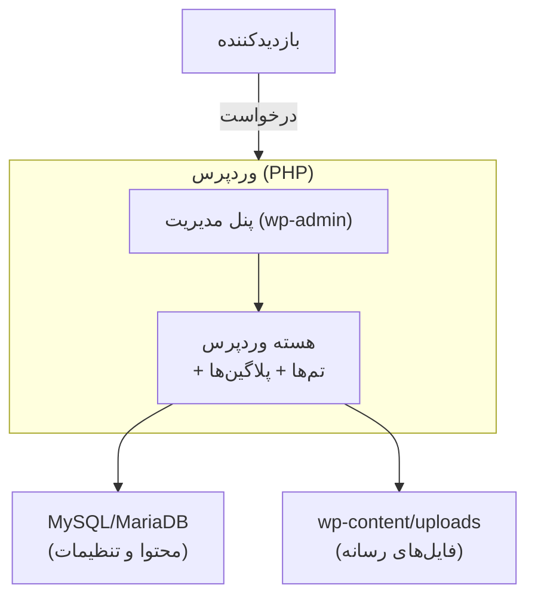
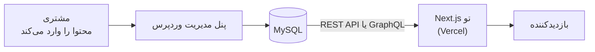

# فصل ۱ — وردپرس چیست و چطور فکرش کنیم؟

> 🎯 **هدف این فصل:** مدل ذهنی درست: CMS یعنی چی، وردپرس از چه چیزی ساخته شده، اکوسیستمش چیه، و مهم‌تر از همه — اینکه **چرا برای تو به عنوان دولوپر Next.js این ابزار جذابه**. هنوز چیزی نصب نمی‌کنیم.

---

## ۱.۱ — CMS: وقتی مشتری نمی‌تونه کد بزنه

سناریوی آشنا: مشتری یک وب‌سایت می‌خواد که *خودش* بتونه اخبارش رو وارد کنه. اگه با Next.js خالص بسازی، هر بار مشتری بخواد یک پست بذاره باید بیاد بهت بگه یک commit بزنی! 😅

**CMS (Content Management System)** یعنی: یک پنل مدیریت آماده که محتوا رو مشتری اونجا وارد می‌کنه (عنوان، متن، عکس) و سایت ازش می‌خونه. وردپرس = **محبوب‌ترین CMS دنیا** (نیروی محرکه حدود ۴۰٪+ کل وب؛ بیش از ۶۰٪ سهم بازار CMS).

```
مشتری → پنل مدیریت وردپرس → محتوا در MySQL → سایت نمایش می‌دهد
```

## ۱.۲ — وردپرس زیر hood چی داره؟ (برای تو که مهندسی)

سه لایه:



| جزء | چیه | برای تو چه معنایی داره |
|---|---|---|
| **PHP** | زبان سرور وردپرس (۷.۲+) | فقط به اندازه لازم یاد می‌گیری (فصل ۱۱) — از TS ساده‌تره |
| **MySQL** | دیتابیس محتوا | تو SQL بلدی! جدول‌هاش رو فصل ۱۰ نگاه می‌کنیم |
| **wp-content** | جایی که تم‌ها، پلاگین‌ها و آپلودها زندگی می‌کنن | ⭐ تنها جایی که *تغییر می‌دی*؛ هسته رو هرگز دست نمی‌زنی |

## ۱.۳ — اکوسیستم: تم‌ها و پلاگین‌ها

قدرت واقعی وردپرس، اکوسیستمش است (ده‌ها هزار پلاگین رایگان):

| مفهوم | چی می‌کنه | شبیه به |
|---|---|---|
| **تم (Theme)** | ظاهر و قالب سایت — نحوه نمایش | design system + layout |
| **پلاگین (Plugin)** | افزودن قابلیت: فروشگاه، فرم، SEO، مولتی‌زبان | npm package |
| **ابزارک/بلوک (Block)** | واحدهای UI در ادیتور (پاراگراف، گالری...) | کامپوننت‌های React! |

> 💡 ادیتور وردپرس (گوتنبرگ) از داخل با **React** نوشته شده! یعنی مفهوم «بلوک» که فصل ۴ می‌بینی، دقیقاً همون کامپوننت‌محوریه که تو می‌فهمی.

## ۱.۴ — wp.org در برابر wp.com (سوال همیشگی)

| | WordPress.org | WordPress.com |
|---|---|---|
| چیه؟ | نرم‌افزار متن‌باز — خودت نصب می‌کنی | سرویس میزبانی تجاری بر پایه همون |
| کنترل کامل (تم/پلاگین دلخواه) | ✅ کامل | ❌ محدود |
| نصب لوکال و توسعه | ✅ | ❌ |
| ما کدوم؟ | ⭐ **این یکی** | نه |

از این به بعد منظورمون همیشه **WordPress.org** (خودِ نرم‌افزار) است.

## ۱.۵ — چرا این دوره برای تو طلاییه: Headless 🚀

دو راه استفاده از وردپرس:

| | Classic (سنتی) | Headless (بی‌سر!) |
|---|---|---|
| فرانت چیه؟ | تم PHP خود وردپرس | **Next.js تو!** ⭐ |
| وردپرس چه نقشی داره؟ | همه‌چیز: فرانت + بک + پنل | فقط **بک‌اند و پنل محتوا** |
| مهارت لازم | PHP | React/Next (که بلدی!) |
| سرعت و UX | محدود به PHP | SSG/ISR مدرن ⭐ |
| برای مشتری | پنل وردپرس | همون پنل وردپرس! |



یعنی: مشتری پنل آشنای وردپرس رو می‌گیره، تو فرانت رو با Next.js می‌سازی. بهترین دو دنیا — و دقیقاً همون چیزیه که بخش سوم دوره می‌سازیش.

**نکته واقع‌بینانه:** وردپرس Headless برای هر پروژه‌ای نیست (سایت‌های خیلی ساده با تم آماده سریع‌تر رِدی می‌شن). ولی برای پروژه‌های جدی با UI سفارشی و پرفورمنس بالا، ترکیب برنده است.

---

## ✅ جمع‌بندی فصل

- CMS = پنل محتوا برای مشتری؛ وردپرس = پادشاهش (۴۰٪+ وب)
- زیر hood: PHP + MySQL + `wp-content` (تنها جای تغییرات تو)
- تم = ظاهر، پلاگین = قابلیت، بلوک = کامپوننت (با React نوشته شده!)
- WordPress.org (نرم‌افزار) نه .com (سرویس)
- **Headless:** وردپرس فقط بک‌اند و پنل؛ فرانت = Next.js تو

## 📝 تمرین فصل ۱

1. با یک جمله: چرا مشتری‌ها CMS می‌خوان ولی دولوپرها همیشه با فریم‌ورک دوستشون ندارن؟
2. در مدل Headless، وردپرس چه لایه‌هایی رو برای تو حل می‌کنه؟ (سه چیز بنویس)
3. فرق wp.org و wp.com رو به یک دوست غیر‌فنی توضیح بده با analogi مناسب. (مثلاً: اندروید خام در مقابل گوشی با لایسنس...)
4. یک پروژه واقعی فکر کن (مثلاً سایت یک رستوران): کدوم بخش‌هاش محتوا است که مشتری باید خودش ویرایش کنه؟ (منو، آدرس، قیمت‌ها...)

<details><summary>نکته تمرین ۲</summary>

پنل مدیریت محتوا (برای مشتری)، REST/GraphQL API (لایه داده استاندارد)، مدیریت کاربران و نقش‌ها و رسانه — یعنی کل بک‌اند CMS. تو فقط UI می‌سازی.
</details>

➡️ **فصل بعد:** زیرساخت وب — دامنه، هاست، DNS و SSL؛ کلماتی که مشتری و هاستینگ‌ها مدام می‌گویند.
