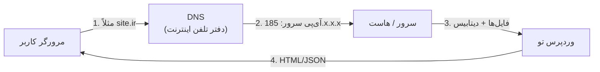

# فصل ۲ — زیرساخت وب: دامنه، هاست، DNS و SSL

> 🎯 **هدف:** قبل از نصب وردپرس، زبان این دنیا را یاد بگیر: دامنه چیست، هاست کجاست، DNS چطور «آدرس» را به «سرور» وصل می‌کند و SSL چرا حیاتیه. این فصل یعنی: هر وقت مشتری یا هاستینگ گفت «نیم‌اس، سی‌پنل، رکورد MX»، تو *دقیقاً* بدانی چه می‌گویند. هنوز چیزی نمی‌خریم و نصب نمی‌کنیم.

---

## ۲.۱ — نقشه بزرگ: سایت تو کجا زندگی می‌کند؟

وقتی یک URL را باز می‌کنی، این زنجیره اتفاق می‌افتد:

سه موجودیت اصلی:

| موجودیت | چیست | آنالوژی از دنیای تو |
|---|---|---|
| **دامنه (Domain)** | اسم سایت: `site.ir` | اسم ریپو در GitHub |
| **هاست (Hosting)** | کامپیوتری روشن که فایل‌ها و دیتابیس تو را نگه می‌دارد | سرور/VPS که اپ Next.js را رویش deploy می‌کنی |
| **DNS** | سرویسی که دامنه را به آی‌پی سرور ترجمه می‌کند | routing لایه شبکه |

> 💡 برای تو که با Vercel کار کرده‌ای: وردپرس = اپ تو، هاست = Vercel (ولی خودت نگهش می‌داری)، دامنه = custom domain، DNS = همان تنظیمات `A`/`CNAME` که موقع وصل‌کردن دامنه به Vercel زده‌ای! هیچ چیز جدیدی نیست — فقط GUI اش سی‌پنل است.

## ۲.۲ — دامنه (Domain)

ساختار: `sub.domain.tld` — مثل `blog.mysite.ir`:

| بخش | مثال | توضیح |
|---|---|---|
| **TLD** (پسوند) | `.com`, `.ir`, `.net`, `.shop` | com جهانی؛ ir داخلی (با تفاوت مهم — پایین) |
| نام دامنه | `mysite` | همان چیزی که می‌خری |
| زیردامنه | `blog.` `shop.` | رایگان — روی هر هاستی می‌سازی |

**قواعد خرید دامنه:**

- **کوتاه و خوانا** — `shop-royal-iran1.com` نه؛ `royalshop.ir` آری
- **`.ir` در برابر `.com`:**

| | `.ir` | `.com` |
|---|---|---|
| ثبت و تمدید | ارزان‌تر (از رجیستری ایران) | گران‌تر (ارزی) |
| ثبت‌کننده رسمی | **ایرنیک (irnic.ir)** ⭐ — با هویت ملی | هر رجیستری جهانی |
| تحریم/قطعی | مقاوم‌تر برای بازار داخلی | وابسته به وضعیت بین‌المللی |
| تراست کاربر ایرانی | بالا (بازدیدکننده به دامنه ایرانی اعتماد دارد) | بالا (جهانی) |

> 🔑 **ایرنیک (IRNIC)** = سازمان ثبت دامنه‌های ایران. برای دامنه `.ir` باید در irnic.ir حساب با هویت تأییدشده بسازی. پنلش قدیمی است ولی کار می‌کند — در فصل ۱۸ باهاش کار می‌کنیم.

**Whois** = جستجوی اطلاعات مالکیت دامنه (به whois.ir یا whois.com برو، دامنه را بنویس: مالک، تاریخ ثبت و انقضا). کاربردها:
1. قبل از خرید یک دامنه، ببین آزاد است یا نه
2. ببین دامنه‌ای که مشتری می‌گوید «مال من است» واقعاً به چه کسی ثبت شده (بارها پیش آمده که دامنه به نام سازنده قبلی سایت است، نه مشتری! ⚠️)

## ۲.۳ — DNS: رکوردهایی که باید بشناسی

DNS مثل دفتر تلفن است: اسم → آدرس. رکوردهای پرکاربرد:

| رکورد | کارش | نمونه |
|---|---|---|
| **A** | دامنه → آی‌پی سرور | `site.ir → 185.55.x.x` |
| **CNAME** | اسم → اسم دیگر | `www.site.ir → site.ir` |
| **MX** | ایمیل‌های دامنه کجا بروند | `mail.site.ir` |
| **NS** | سرورهای DNS مسئول | `ns1.hosting.ir` |
| **TXT** | احراز مالکیت/امضای ایمیل | رکورد SPF و DKIM |

- TTL (زمان کش شدن رکورد) را موقع انتقال کم بگذار (مثلاً ۳۰۰ ثانیه) — وگرنه تغییر DNS تا ۲۴ ساعت کش می‌ماند
- **مقایسه دولوپری:** وقتی دامنه را به Vercel وصل می‌کنی و می‌گوید «رکورد A را به `76.76.21.21` تغییر بده» — دقیقاً همین کار است، فقط اینجا با پنل هاستینگ

## ۲.۴ — هاست: خانه فایل‌های تو

انواع هاست (از ارزان به گران):

| نوع | چیست | مناسب | معادل ذهنی تو |
|---|---|---|---|
| **اشتراکی (Shared)** ⭐ | یک سرور، صدها سایت باهم | سایت شرکتی/بلاگ/فروشگاه کوچک | پلن رایگان Vercel |
| **VPS** | سرور مجازی خصوصی — منابع تضمینی | فروشگاه شلوغ، چند سایت | VPS که داکر را رویش بالا می‌آوری |
| **ابری (Cloud)** | مقیاس‌پذیر، پرداخت به مصرف | پروژه‌های جدی با ترافیک بالا | Vercel Pro / AWS |

برای وردپرس به این‌ها نیاز داری: **PHP + MySQL + وب‌سرور (Apache/Nginx)** — همان استکی که Local خودش نصب می‌کند (فصل ۳).

**پنل مدیریت هاست** — GUI که همه‌کار با آن است:

- **cPanel** ⭐ رایج‌ترین (ایران و جهان)
- **DirectAdmin** — سبک‌تر، در هاست‌های ایرانی زیاد است
- هر دوتا یک کار می‌کنند؛ در این دوره از تصاویر سی‌پنل استفاده می‌کنیم

ابزارهای داخل پنل که در فصل ۱۸ از آن‌ها استفاده می‌کنیم:

| ابزار | کار |
|---|---|
| **File Manager** | فایل‌سیستم هاست در مرورگر (آپلود/اکسترکت zip وردپرس) |
| **MySQL Databases** | ساخت دیتابیس + کاربر و رمز |
| **phpMyAdmin** | مدیریت دیتابیس در مرورگر (همان که در Local دیدی) |
| **Softaculous / WordPress Installer** | نصب وردپرس یک‌کلیکی |
| **SSL/TLS Status** | صدور گواهی رایگان Let's Encrypt |

> ⚠️ خرید هاست: حتماً هاست **وردپرسی/لینوکسی** بگیر نه ویندوزی؛ حداقل PHP 8.1+ و MySQL 8؛ و پشتیبانی پاسخ‌گو — در بازار ایران پشتیبانی = نصف قیمت هاست.

## ۲.۵ — دیتابیس: همان MySQL که می‌شناسی

وردپرس محتوا را در **MySQL/MariaDB** نگه می‌دارد — همان SQL که با Prisma/Postgres کار کردی، اینجا با این تفاوت‌ها:

- هر وردپرس یک دیتابیس با پیشوند جدول‌ها `wp_` (فصل ۴ با جدول `wp_posts` کار کردیم)
- اطلاعات اتصال در فایل `wp-config.php` است (معادل `.env` تو): `DB_NAME`, `DB_USER`, `DB_PASSWORD`, `DB_HOST`
- در هاست، دیتابیس و کاربر را **جدا** می‌سازی و به هم وصل می‌کنی (بخش MySQL Databases سی‌پنل) — دقت کن: کاربر دیتابیس ≠ کاربر ورود به پنل هاست

> 💡 چرا این توضیح مهم است؟ چون در فصل ۱۸ موقع نصب روی هاست، پر کردن همین چهار مقدار در `wp-config.php` کل مرحله «اتصال به دیتابیس» است — و ۸۰٪ خطاهای نصب روی هاست از همین‌جاست (کاربر با دیتابیس وصل نشده یا localhost نباشد).

## ۲.۶ — SSL و HTTPS: قفل سبز کنار آدرس

**SSL/TLS** = رمزنگاری مسیر مرورگر تا سرور. بدون آن: `http://` (با آیکون هشدار!) و با آن: `https://` (قفل). چرا حیاتی است:

1. **اعتماد کاربر** — مرورگرها سایت‌های بدون SSL را «ناامن» برچسب می‌زنند
2. **سئو** — گوگل HTTPS را عامل رتبه‌بندی می‌داند (فصل ۸)
3. **پرداخت آنلاین** — درگاه‌های ایرانی بدون SSL اصلاً کار نمی‌کنند (فصل ۱۲ و ۱۸)
4. **API تو** — در Headless، Next.js روی Vercel باید با `https` به وردپرس وصل شود (فصل ۱۷)

خبر خوب: امروز SSL ارزان نیست — **رایگان است**:

- در هاست: **Let's Encrypt** از سی‌پنل (SSL/TLS Status → Run AutoSSL) — تمدید خودکار
- در Local: برنامه Local خودش گواهی محلی می‌سازد (https با اخطار مرورگر که طبیعی است)

> 🔑 در وردپرس بعد از فعال‌سازی SSL، آدرس سایت در **Settings → General** به `https://` تغییر می‌کند و با یک جست‌وجو-جایگزین لینک‌های قدیمی `http` اصلاح می‌شوند (فصل ۱۸ گام‌به‌گام).

## ۲.۷ — سه اصطلاح دیگر که خواهی شنید

| اصطلاح | یعنی | کجا می‌شنویش |
|---|---|---|
| **Nameserver (NS)** | «DNS سایتت را کدام شرکت نگه می‌دارد» — موقع خرید هاست، دو آدرس `ns1...` و `ns2...` می‌دهند که در پنل دامنه وارد کنی | اتصال دامنه به هاست (فصل ۱۸) |
| **Propagation** | پخش شدن تغییرات DNS در دنیا (چند دقیقه تا ۲۴ ساعت) | «سایتم باز نمی‌شود!» — صبر، نه پنیک |
| **کنترل پنل دامنه** | پنل ایرنیک یا رجیستری جهانی — جای تغییر NS | مدیریت دامنه |

---

## ✅ جمع‌بندی فصل

- زنجیره: **دامنه → DNS → هاست (PHP+MySQL) → سایت**؛ هر URL باز شده همین مسیر است
- دامنه `.ir` با **ایرنیک** (ارزان و داخلی) یا `.com` جهانی — whois برای چک مالکیت
- رکوردهای DNS: A و CNAME و MX و NS — همان کارهایی که با دامنه در Vercel کرده‌ای
- هاست اشتراکی برای شروع کافی است؛ سی‌پنل = GUI برای File Manager + MySQL + نصب وردپرس
- **SSL رایگان** (Let's Encrypt) — ضروری برای سئو، اعتماد و درگاه پرداخت

## 📝 تمرین فصل ۲

1. برای یک پروژه فرضی (مثلاً سایت فروش شیرینی‌پزی) ۵ نام دامنه پیشنهاد بده؛ یکی `.ir` و یکی `.com` — قیمت تقریبی هر دو را چک کن (irnic.ir و یک رجیستری جهانی).
2. آدرس سایت هر شرکتی را در whois بزن: مالک ثبت‌شده کیست؟ تاریخ انقضای دامنه کی است؟
3. سه رکورد DNS را از حافظه توضیح بده: A چه می‌کند؟ MX چه؟ CNAME چه؟
4. فرق هاست اشتراکی و VPS را با آنالوژی Vercel رایگان در برابر VPS شخصی توضیح بده — یک سایت فروشگاهی با ۱۰۰۰ بازدید روزانه کدام؟
5. (کشف) در مرورگر کنار قفل آدرس سایت‌های مختلف را ببین؛ یک سایت `http` بدون SSL پیدا کن — چه هشداری می‌دهد؟

نکته تمرین ۴

۱۰۰۰ بازدید روزانه برای وردپرس خیلی نیست — هاست اشتراکی خوب جواب می‌دهد (وردپرس با کش، فصل ۱۳، صدها بازدید همزمان را مدیریت می‌کند). VPS جایی لازم است که ترافیک سنگین شود یا چند سایت/سرویس داشته باشی — همان جایی که به docker compose فکر می‌کنی.

➡️ **فصل بعد:** نصب وردپرس روی سیستم خودت با برنامه Local — پنج دقیقه‌ای!
