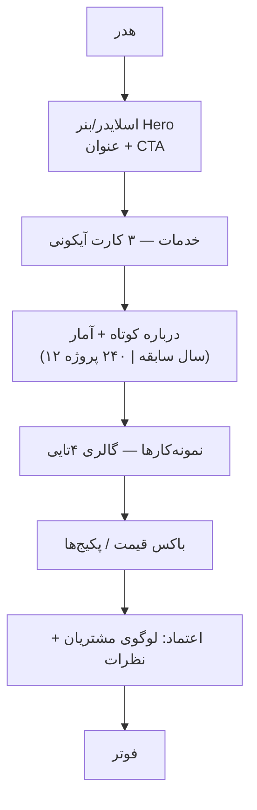

# فصل ۶ — صفحه‌سازی عملی: هدر، فوتر، منو، مگامنو و Elementor

> 🎯 **هدف:** از «تنظیمات» به «طراحی» می‌رویم. یک سایت شرکتی واقعی می‌سازیم: هدر و فوتر حرفه‌ای، منو و مگامنو، صفحه اصلی با باکس‌های آماری و قیمت، اسلایدر و فرم — هم با Site Editor بلوکی و هم با Elementor. این فصل یعنی: بتوانی ظاهر کاری مشتری را خودت از صفر بسازی.

---

## ۶.۱ — دو مسیر صفحه‌سازی: Site Editor در برابر Elementor

همان بحث فصل ۵، ولی این بار عملی. دو ابزار، دو فلسفه:

| | **Site Editor (بلوکی)** | **Elementor** |
|---|---|---|
| چیه | ادیتور بلوکی برای کل سایت — بخشی از خود وردپرس | پلاگین صفحه‌ساز درگ‌اند‌دراپ |
| سبک کار | بلوک + استایل‌های سراسری | Section/Column/Widget با تنظیمات زنده |
| وزن | سبک (هسته وردپرس) | سنگین‌تر (پلاگین + فایل‌های CSS/JS زیاد) |
| هزینه | رایگان (نسخه Pro تم‌ها جدا) | رایگان + نسخه Pro پولی |
| آینده | ⭐ مسیر رسمی وردپرس | محبوبِ بازار ایران و تم‌های premium |
| در Headless | بلاک‌ها → HTML در `content.rendered` | خروجی HTML سنگین — برای Headless **غیرقابل استفاده** (فصل ۱۰ به بعد) |

**قاعده تصمیم ⭐:** مشتری ایرانی که «خودش همه‌چیز را بکشد و رها کند» می‌خواهد → Elementor. پروژه‌ای که تو فرانت آن را با Next.js می‌سازی → این فصل را با Site Editor بخوان و بخش Elementor را فقط برای شناخت بازار. هر دو را اینجا تمرین می‌کنیم.

> 💡 اگر تم‌های premium ایرانی (مثل قالب‌های فروشگاهی رایج بازار) دیدی، بدان اکثراً با **WPBakery (ویژوال کامپوزر)** یا Elementor ساخته شده‌اند — ردیف/ستون/ویجت همان الگوی این فصل است.

## ۶.۲ — پروژه این فصل: سایت شرکتی «برق‌آسا»

تمرین‌های فصل روی یک نمونه واقعی است: سایت شرکت خدمات برق صنعتی با ۵ صفحه:

```text
خانه  |  درباره ما  |  خدمات  |  نمونه‌کارها  |  تماس با ما
```

صفحات را در **Pages → Add New** بساز (فصل ۴) — محتوای هر صفحه را پایین‌تر طراحی می‌کنیم.

## ۶.۳ — هدر و فوتر: چهره سایت

**هدر (Header)** = نوار بالای همه صفحات: لوگو + منو + دکمه CTA («تماس بگیرید»). **فوتر (Footer)** = پایین همه صفحات: آدرس/تلفن، لینک‌های سریع، شبکه‌های اجتماعی، کپی‌رایت.

**با Site Editor (تم بلوکی):** Appearance → Editor → روی **Header** و **Footer** (Template Parts) کلیک کن:

- لوگو: بلوک **Site Logo** (از Settings → General لوگو آپلود کن)
- منو: بلوک **Navigation** (بند ۶.۴)
- شماره تلفن/ساعت کاری: بلوک Paragraph با آیکون (فصل ۸: ستون‌ها)
- فوتر: بلوک **Site Title** + Paragraph + بلوک **Social Icons**

**با Elementor:** پلاگین **Elementor + Elementor Header & Footer Builder** را نصب کن (فصل ۷: نصب پلاگین) → Templates → Theme Builder → Header/Footer جدید → با ویجت‌ها طراحی → Condition: «Entire Site».

> ⚠️ قانون طراحی هدر: حداکثر **۷ آیتم منو**، لوگو چپ (در RTL راست)، دکمه تماس برجسته با رنگ اصلی سایت. هدر شلوغ = کاربر گم.

## ۶.۴ — منو و مگامنو

**منوی ساده:** Appearance → Menus (تم کلاسیک) یا مستقیم بلوک Navigation (تم بلوکی):

1. منوی «Main Menu» بساز
2. صفحات ۶.۲ + دسته‌بندی بلاگ را اضافه کن
3. زیرمنو: آیتم را drag کن زیر آیتم دیگر (کلاس `submenu` در ذهن تو)
4. در تم‌های بلوکی جای نمایش منو = Header؛ در کلاسیک: Location → Primary

**مگامنو (Mega Menu)** = زیرمنوی پهن چندستونه (مثل منوی «خدمات» در سایت‌های بزرگ که ستون‌بندی شده باز می‌شود):

- در تم‌های premium و تم‌های ووکامرسی معمولاً قابلیت مگامنو داخلی است (تنظیمات تم)
- در Site Editor: به جای منوی معمولی، یک Template Part جدا بساز که فقط در hover منو نمایش داده شود (الگوی رایج: منوی ساده + صفحه لندینگ جدا برای هر دسته)
- با Elementor Pro: ویجت Mega Menu آماده دارد
- ⭐ قانون محتوایی: مگامنو را با **صفحات/لینک‌های واقعی** پر کن نه «به‌زودی» — منوی خالی یعنی کاربر خالی

## ۶.۵ — صفحه اصلی: Section ها، ردیف و ستون

صفحه اصلی سایت شرکتی، الگوی استاندارد بازار:



**با بلوک‌ها:** بلوک **Columns** برای کارت‌ها، **Cover** برای Hero (عکس پس‌زمینه + متن رویش)، **Group** برای باکس‌ها — padding و margin را در Sidebar هر بلوک تنظیم کن (dimensions = همان box model که بلدی).

**با Elementor:** ساختار **Section → Column → Widget**:
- ردیف (Section) = یک سطر افقی؛ ستون‌ها داخلش؛ ویجت‌ها داخل ستون (Heading, Image, Button, Icon Box, ...)
- هر عنصر سه تب تنظیم دارد: **Content** (محتوا) / **Style** (رنگ، فونت) / **Advanced** (فاصله، سایه، مارجین)
- **Responsive:** آیکون موبایل کنار هر تنظیم — جدا برای دسکتاپ/تبلت/موبایل ⭐ (مثلاً در موبایل فونت H1 را کوچک کن)

> 💡 مفاهیم padding/margin و فرق‌شان برای تو دوغ است؛ نکته وردپرسی: در Elementor از پدینگ Section برای «ارتفاع‌دهی» استفاده می‌شود (مثلاً 80px بالا/پایین) — الگوی همه قالب‌های بازار.

## ۶.۶ — جعبه‌ابزار باکس‌های پرکاربرد

هرچه در سایت‌های ایرانی می‌بینی، این‌هاست:

| باکس | با بلوک | با Elementor |
|---|---|---|
| **اسلایدر** | بلوک Slides (تم‌های بلوکی) یا پلاگین Slides | ویجت Image Carousel / Slides |
| **باکس قیمت** | Group + Columns + Button | ویجت Price Table (در Pro) یا Column با استایل |
| **باکس جستجو** | بلوک Search | ویجت Search |
| **ویدیو** | بلوک Video (آپلودی) / Embed (آپارات/یوتیوب) | ویجت Video |
| **موزیک/پادکست** | بلوک Audio | ویجت Audio |
| **آیکون‌ها** | بلوک Social Icons | ویجت Icon / Icon Box |
| **شمارنده آمار** | — (بلوک آماده ندارد) | ویجت Counter |
| **نقشه** | Embed نقشه | ویجت Google Maps (فصل ۸: نشان/بلد) |

افکت‌ها: **سایه** (Box Shadow در Style/Advanced)، **hover** (تب Hover در Elementor؛ در بلوک‌ها فقط استایل ثابت) و **پس‌زمینه** (رنگ/عکس/گرادیان در هر Section).

> ⚠️ کم‌زور کن با سایه و انیمیشن — «طراحی خفن» بازار ایران یعنی: سفید/فضای خالی/یک رنگ اصلی/عکس باکیفیت. اسلایدر ۵ اسلایدی با ۷ انیمیشن = طراحی ۱۳۹۵!

## ۶.۷ — آیکون سایت (Favicon) و لوگو

آیکون کوچک کنار تب مرورگر (لوگوی کوچک!):

1. عکس مربع ۵۱۲×۵۱۲ بساز (PNG با پس‌زمینه شفاف)
2. **Appearance → Editor → Styles → (⋮) → Site Identity** (یا Customizer در تم کلاسیک)
3. **Site Icon** → آپلود — وردپرس همه سایزها را خودش می‌سازد (در API هم `site_icon` می‌آید)
4. همان‌جا **Site Logo** را هم ست کن (هدر از آن می‌خواند)

## ۶.۸ — فرم تماس و سایدبار

**فرم تماس:** پلاگین **Contact Form 7** یا **Fluent Forms** (فصل ۷) → شورت‌کد/بلوک فرم را در صفحه «تماس با ما» بگذار → ایمیل‌های فرم را با SMTP وصل کن (فصل ۱۳ — بدون SMTP ایمیل‌ها گم می‌شوند ⚠️). فیلدهای استاندارد: نام، تلفن، موضوع، پیام + تیک رضایت حریم خصوصی (صفحه policy فصل ۹).

**سایدبار (Sidebar):** در تم‌های کلاسیک: Appearance → Widgets (ابزارک‌ها) — جستجو، پست‌های اخیر، دسته‌ها. در تم‌های بلوکی سایدبار هم Template Part است. در طراحی مدرن (و Headless) معمولاً بدون سایدبار هستیم — فقط این مفهوم را بشناس چون قالب‌های قدیمی ایرانی پر از آن است.

## ۶.۹ — کاهش حجم تصاویر: بدترین دشمن سرعت

سایت‌های صفحه‌سازی‌شده معمولاً از عکس‌های سنگین می‌میرند (فصل ۴: Media). قواعد:

- قبل از آپلود: عکس‌ها را فشرده کن — **squoosh.app** (رایگان، مرورگری، ساخت گوگل) یا tinypng.com
- اندازه واقعی نمایش: کارت ۴۰۰px عرض لازم دارد، نه عکس ۴۰۰۰ پیکسلی آیفون!
- فرمت: **WebP** برای همه عکس‌ها (سایز ~۳۰٪ JPEG)؛ PNG فقط برای لوگو/شفاف
- پلاگین خودکار: **Smush** یا **ShortPixel** — همه آپلودی‌ها را فشرده و WebP می‌کند (فصل ۷)

```text
قبل: hero.jpg 4.2MB → لود ۸ ثانیه در ۴G
بعد: hero.webp 180KB → لود ۰.۵ ثانیه  🚀
```

## ۶.۱۰ — تصمیم نهایی: Elementor یا بلوک یا Headless؟

| سناریوی مشتری | راه تو |
|---|---|
| «سایت شرکتی ساده، خودم می‌خوام ادیت کنم، بودجه کم» | تم بلوکی + Site Editor (یا Elementor اگر تم premium خواست) |
| «فروشگاه می‌خوام» | ووکامرس + تم فروشگاهی (فصل ۱۲) |
| «سایت جدی/برند قوی/پرفورمنس مهم است» | ⭐ **Headless: وردپرس فقط پنل، فرانت Next.js** — و همه‌چیز این فصل در فرانت با کد ساخته می‌شود (فصل ۱۶) |

> 🔑 نکته فروش (فصل ۱۹): Elementor سرعت تحویل بالا می‌دهد ولی چون هر کسی بلدش است، قیمتش پایین است. Headless تخصص کمیاب است — قیمتش ۳-۵ برابر است. هر دو را بلد باش، بر اساس بودجه انتخاب کن.

---

## ✅ جمع‌بندی فصل

- هدر/فوتر = Template Part در Site Editor یا Theme Builder در Elementor
- منو با Navigation/Menus؛ مگامنو = زیرمنوی چندستونه (تنظیمات تم یا Elementor Pro)
- صفحه اصلی = الگوی Hero → خدمات → آمار → نمونه‌کار → قیمت → اعتماد
- Elementor: Section/Column/Widget با سه تب Content/Style/Advanced + تنظیم Responsive جدا
- **Favicon در Site Icon**؛ فرم تماس = پلاگین + SMTP
- **عکس فشرده/WebP قبل از آپلود** — سرعت = سئو = پول

## 📝 تمرین فصل ۶ (پروژه: سایت «برق‌آسا»)

1. ۵ صفحه پروژه را بساز و یک منوی «Main Menu» با زیرمنو (خدمات → سه زیرسرویس) بساز و در هدر بگذار.
2. در Site Editor هدر و فوتر کامل بساز: لوگو + منو + دکمه تماس / فوتر با ۴ ستون (درباره، لینک‌ها، تماس، شبکه‌های اجتماعی).
3. صفحه خانه را با الگوی ۶.۵ بساز: Cover برای Hero + Columns برای ۳ کارت خدمات + باکس آمار.
4. آیکون سایت (Favicon) را ست کن — تب مرورگر را ببین.
5. با Elementor (رایگان) یک صفحه «تماس با ما» جایگزین بساز: فرم + نقشه + اطلاعات — مقایسه کن با روش بلوکی.
6. سه عکس Hero را در squoosh.app فشرده و به WebP تبدیل کن — حجم قبل/بعد را یادداشت کن و در رسانه آپلود کن.

<details><summary>نکته تمرین ۳</summary>

Hero با بلوک Cover: عکس پس‌زمینه + Overlay (کدرنگ) + درونش Heading و Button. تنظیم کلیدی: حداقل ارتفاع (min-height) ۶۰vh در Sidebar → چشم‌نواز می‌شود. برای کارت‌های خدمات: یک Columns سه‌ستونه؛ در هر ستون: Image + Heading + Paragraph + Button.
</details>

➡️ **فصل بعد:** پلاگین‌ها — قابلیت‌های اضافه و ضروری‌ها؛ همان‌هایی که در این فصل پیش‌نمایششان را دیدی.
