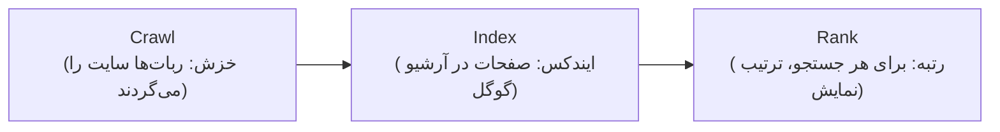

# فصل ۸ — سئو عملی: دیده‌شدن در گوگل

> 🎯 **هدف:** سایت خوب ساختن کافی نیست؛ باید **پیدا** شود. در این فصل سئوی عملی وردپرس را یاد می‌گیری: تنظیم Yoast/Rank Math، ساختار محتوای درست، گوگل سرچ کنسول، ثبت در نقشه‌ها (گوگل/نشان/بلد) و سئوی محلی برای کسب‌وکارهای ایرانی. در آخر، پل سئو به دنیای Headless.

---

## ۸.۱ — گوگل چطور فکر می‌کند؟

سه مرحله برای هر سایت:



سئو = کار کردن روی هر سه لایه. عوامل مهم رتبه (به ترتیب اثر واقعی):

| عامل | در وردپرس کجاست |
|---|---|
| محتوای مفید و متصل (لینک داخلی) | پست‌ها و صفحات (فصل ۴) |
| **عنوان و توضیح متا** ⭐ | پلاگین SEO (این فصل) |
| سرعت سایت | کش/تصویر (فصل ۶ و ۱۳) |
| موبایل‌فرندلی | تم responsive (فصل ۵ و ۶) |
| SSL | فصل ۲ و ۱۸ |
| ساختار URL تمیز | **Permalink → Post name** (فصل ۹ — اگر نرفتی، برو!) |

## ۸.۲ — پلاگین سئو: Yoast یا Rank Math

Yoast را فصل ۷ نصب کردی. جایگزین محبوب: **Rank Math** (رایگان با امکانات بیشتر). هر دو کار را می‌کنند — یکی را انتخاب کن:

در صفحه ویرایش هر پست/صفحه، باکس Yoast پایین‌تر اضافه شده:

1. **Focus Keyphrase** (کلمه کلیدی): مثلاً «تابلو برق صنعتی» — Yoast تحلیل می‌کند که چقدر در محتوا رعایت شده (سبز/نارنجی/قرمز)
2. **SEO Title** (عنوان متا): ⭐ مهم‌ترین تگ سئو — الگو: `کلمه کلیدی | برند` — زیر ~۶۰ کاراکتر (چون گوگل برش می‌زند)
3. **Meta Description** (توضیح متا): ~۱۵۰ کاراکتر، تبلیغی و کلیک‌خور — نه کپی متن پست!
4. **Slug:** کوتاه و با کلمه کلیدی (`/tablo-bergh-sanati/`)

پیش‌نمایش گوگل همان‌جا است — قبل از انتشار ببین در نتایج چطور دیده می‌شوی.

**تنظیمات سراسری Yoast (منوی Yoast SEO):**

- **General → Features:** همه پیش‌فرض خوب است؛ XML sitemaps روشن ✅
- **Search Appearance:** عنوان/توضیح پیش‌فرض برای هر نوع محتوا + علامت برند
- **شمای سازمانی (Schema):** در Rank Math/Yoast، نوع کسب‌وکار را ست کن

## ۸.۳ — sitemap و گوگل سرچ کنسول

**Sitemap** = فهرست XML همه صفحات سایت برای گوگل: `yoursite.ir/sitemap_index.xml` (Yoast خودش می‌سازد).

**Google Search Console (GSC)** — search.google.com/search-console — پنل رسمی گوگل برای وبمسترها؛ ⭐ رایگان و حیاتی:

1. **Add Property** → دامنه یا URL prefix (با DNS یا فایل HTML تأیید کن — همان رکورد TXT فصل ۲!)
2. **Sitemaps** → آدرس sitemap را سابمیت کن
3. **URL Inspection:** آدرس هر صفحه را بزن → «Request Indexing» برای ایندکس سریع (به‌جای انتظار هفته‌ای)
4. بعد از چند روز: گزارش Performance (چه کلماتی آوردت؟) و Coverage (کدام صفحات ارور ۴۰۴/redirect دارند؟)

> 🔑 GSC = آنالوژی Lighthouse در مرورگر: همان چیزی که برای Next.js به آن نگاه می‌کنی، برای وردپرس هم همین است — ارورها را خود گوگل می‌گوید!

## ۸.۴ — ساختار محتوا: قواعد صفحه‌ای

هر صفحه/پست برای سئوی داخلی:

- **فقط یک H1** (عنوان صفحه) — تیترها با H2/H3 سلسله‌مراتبی (بلوک Heading — فصل ۴)
- **کلمه کلیدی** در: H1، اولین پاراگراف، حداقل یک H2، alt یک عکس، و slug
- **لینک داخلی:** ⭐ هر پست به ۲-۳ صفحه دیگر خود سایت لینک بدهد (Yoast همین را یادآوری می‌کند) — لینک داخلی = خون‌رسانی سئو
- **Alt تصویر:** توصیفی و با کلمه کلیدیِ طبیعی (فصل ۴: در API هم می‌آید)
- محتوای حداقلی: صفحات موروثیِ «درباره ما» ۳ خطی رتبه نمی‌گیرند — ۴۰۰+ کلمه با محتوای واقعی

## ۸.۵ — سئوی محلی: گوگل مپ، نشان و بلد 🇮🇷

برای کسب‌وکارهای محلی (رستوران، خدماتی، فروشگاه فیزیکی) — نیمی از بازار کار تو:

| سرویس | کجا | نکته |
|---|---|---|
| **Google Business Profile** | business.google.com | رایگان — ثبت با آدرس دقیق + تلفن + ساعت کاری + عکس؛ روی نقشه گوگل می‌افتید و در جستجوهای محلی («تابلو برق نزدیک من») ظاهر می‌شوید |
| **نشان (neshan.org)** | پنل کسب‌وکار | نقشه محبوب ایرانی — اپ‌های داخلی از API آن استفاده می‌کنند |
| **بلد (balad.ir)** | پنل در بلد | همان نقش؛ هر دو ثبت کن — هزینه صفر |

**در سایت هم نقشه بگذار:** بلوک Embed با آدرس iframe نقشه، یا ویجت Google Maps در Elementor (فصل ۶). برای سایت‌های Headless: کامپوننت نقشه نشان/لفت‌لت در Next.js (فصل ۱۶ به بعد).

> 💡 **NAP (Name, Address, Phone):** نام/آدرس/تلفن کسب‌وکار باید **دقیقاً یکسان** باشد در: سایت، گوگل، نشان، بلد و شبکه‌های اجتماعی — ناسازگاری = کاهش اعتماد گوگل به کسب‌وکار.

## ۸.۶ — سرعت = سئو: Core Web Vitals

گوگل سرعت را مستقیم در رتبه می‌بیند. ابزار سنجش: **PageSpeed Insights** (pagespeed.web.dev) — آدرس سایت را بده:

- **LCP** (بزرگ‌ترین عنصر دیده‌شده): باید < ۲.۵s — معمولاً عکس Hero است (فصل ۶: فشرده‌سازی!)
- **CLS** (پرش چیدمان): < ۰.۱ — عکس‌ها همیشه width/height داشته باشند
- **INP** (سرعت واکنش): < ۲۰۰ms — پلاگین‌های سنگین را کم کن (فصل ۷: کمتر = بهتر)

پلاگین کش (LiteSpeed Cache — فصل ۱۳) + تصاویر WebP معمولاً نمره موبایل وردپرس را از قرمز به سبز می‌برد. در Headless، این بخش را Next.js برایت حل کرده ⭐ (SSR/ISR + next/image) — یکی از دلایلی که Headless می‌فروشیم.

## ۸.۷ — سئو در Headless: پل به فصل ۱۷

وقتی فرانت Next.js باشد، مقادیر Yoast همان‌جا مصرف می‌شوند:

```graphql
query {
  post(id: "my-post", idType: SLUG) {
    title
    # با پلاگین WPGraphQL Yoast SEO:
    seo {
      title          # عنوان متای Yoast
      metaDesc       # توضیح متا
      opengraphImage { sourceUrl }
    }
  }
}
```

و در Next.js با `generateMetadata` به تگ‌های `<head>` تبدیل می‌شود (فصل ۱۷ کامل می‌سازیم). یعنی: مشتری همان‌جا در پنل وردپرس سئو می‌نویسد، سایت Next.js همان را نمایش می‌دهد — سئو از پنل، رندر از فرانت مدرن.

---

## ✅ جمع‌بندی فصل

- سئو = Crawl + Index + Rank؛ کار روی محتوا، متا، سرعت و اعتبار
- Yoast/Rank Math: کلمه کلیدی + عنوان/توضیح متا در هر پست؛ sitemap خودکار
- **GSC را حتماً راه بینداز:** سابمیت sitemap + Request Indexing + گزارش‌ها
- قواعد صفحه: یک H1، کلمه کلیدی طبیعی، لینک داخلی، alt تصویر
- سئوی محلی ایران: **Google Business + نشان + بلد** با NAP یکسان
- سرعت: PageSpeed + کش + WebP — در Headless، Next.js این را می‌تراشد

## 📝 تمرین فصل ۸

1. برای ۳ پست فصل ۴ و صفحه «خدمات» فصل ۶: کلمه کلیدی + SEO Title + توضیح متا بنویس و چراغ Yoast را سبز کن (همه موارد نه — موارد قرمز کافی است).
2. `wp-course.local/sitemap_index.xml` را باز کن — چند sitemap دارد؟ چه نوع‌هایی؟
3. یک Property در GSC بساز (لوکال را تأیید نمی‌کند، ولی کار را با یک سایت تستی تمرین کن) — رابط GSC را گشتی بزن.
4. صفحه «خدمات» را در PageSpeed Insights بده — سه پیشنهاد اولش را بنویس.
5. یک کسب‌وکار واقعی محلی خودت را (یا یک نمونه فرضی) در Google Business و نشان ثبت کن — فرم NAP را کامل پر کن.
6. در Yoast: Search Appearance → Title/Description پیش‌فرض پست‌ها را با برند خودت تنظیم کن.

<details><summary>نکته تمرین ۲</summary>

Yoast برای هر نوع محتوا یک sitemap می‌سازد: `post-sitemap.xml`، `page-sitemap.xml`، و برای CPT پروژه‌ها هم `project-sitemap.xml` (چون فصل ۱۰ آن را public کردی) — همه در sitemap_index جمع‌اند. این فایل‌ها همان‌هایی هستند که در فصل ۱۷ به GSC سایت Next.js می‌دهی.
</details>

➡️ **فصل بعد:** کاربران، نقش‌ها و تنظیمات کلیدی — از جمله Permalink که پایه API است.
