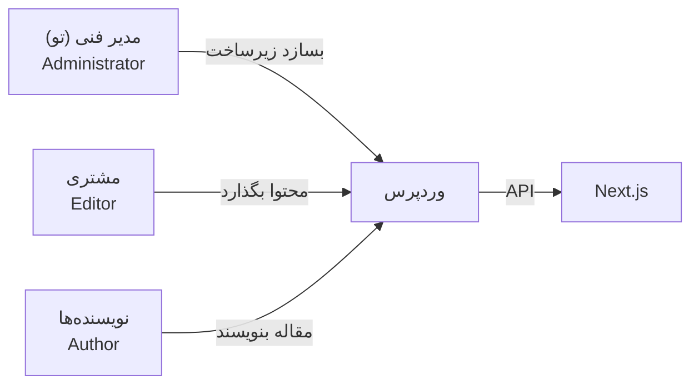

# فصل ۹ — کاربران، نقش‌ها و تنظیمات کلیدی

> 🎯 **هدف:** مدیریت کاربران و نقش‌های دسترسی + تنظیماتی که برای پروژه Headless حیاتی‌ان: **Permalinks** (ساختار URL — مستقیم روی API اثر داره!) و تنظیمات خواندن. آخر فصل، یک User Editor برای مشتری هم ساختی.

---

## ۹.۱ — نقش‌های کاربری: چه کسی چه اجازه‌ای داره؟

وردپرس ۵ نقش پیش‌فرض داره (از کم‌اختیار به پراختیار):

| نقش | کارش | در پروژه واقعی کیه؟ |
|---|---|---|
| Subscriber | فقط پروفایل خودش (کامنت با اسم خودش) | کاربر عادی سایت |
| Contributor | می‌نویسه، ولی انتشار دست **دیگری** است | نویسنده تازه‌کار |
| Author | پست‌های خودش را منتشر می‌کند | نویسنده |
| Editor | همه محتوا: همه پست‌ها، صفحات، دسته‌ها، کامنت‌ها | سردبیر / مدیر محتوا ⭐ |
| Administrator | همه‌چیز: پلاگین، تم، کاربران، تنظیمات | تو (در لوکال) / مدیر فنی |

قاعده‌ی امنیتی مهم برای پروژه واقعی: **مشتری را Editor بده، نه Admin.** چون Admin می‌تونه پلاگین نصب کنه و سایت رو بترکونه. خودت (فنی) Admin می‌مونی.

Users → Add New: یک کاربر `writer` با نقش Author بساز و یک بار باهاش لاگین کن (مرورگر ناشناس) — پنلش رو ببین: پلاگین و تنظیمات غیب شدن!

## ۹.۲ — Permalinks: ساختار URL ها ⭐ (برای Headless حیاتی)

**Settings → Permalinks** — این صفحه تعیین می‌کنه URL پست‌ها چطوری باشه:

| گزینه | نمونه URL | نظر |
|---|---|---|
| Plain | `?p=123` | ❌ سئوی صفر |
| Day and name | `/2026/09/13/عنوان/` | شلوغ |
| **Post name** ⭐ | `/عنوان-پست/` | استاندارد سئو — انتخاب کن! |
| Custom | دلخواه | پیشرفته |

**چرا برای تو حیاتی است؟**

1. **Slug** (قسمت آخر URL) = شناسه‌ای که در Next.js برای routing استفاده می‌کنی: `/blog/[slug]` ← slug از API میاد ← اینجا تعیین می‌شه که slug چی باشه
2. با تغییر ساختار permalink، URL های قدیمی می‌شکنن — پس **اول پروژه تعیینش کن، بعد دست نزن**

در ویرایشگر هر پست هم می‌تونی slug رو دستی تمیز کنی (عنوان فارسی → slug خودکار فارسی؛ برای URL تمیزتر می‌تونی لاتین بزنی: `best-tools-2026`).

## ۹.۳ — تنظیمات خواندن و دیدان (Reading)

**Settings → Reading:**

- **Your homepage displays:** «Your latest posts» (پیش‌فرض) یا یک Page ثابت به عنوان خانه
- **Blog pages show at most:** تعداد پست در هر صفحه آرشیو
- **Search engine visibility:** ☑️ **«Discourage search engines»** — ⚠️ این تیک را **هرگز** در سایت واقعی نزن (سایت از گوگل حذف می‌شود!) فقط برای سایت‌های موقت تست خوبه

## ۹.۴ — تنظیمات مهم دیگر (گشت سریع)

| مسیر | تنظیم مهم | نکته |
|---|---|---|
| General | Site Title / Tagline | عنوان و شعار سایت (در API: `name`, `description`) |
| General | Timezone | Tehran |
| Discussion | کامنت‌ها | مدیریت نظرها — در Headless معمولاً کامنت را از سیستم دیگری می‌گیریم (فصل ۱۷) |
| Media | سایزهای تصویر | اندازه‌های خودکار تولیدی (فصل ۱۷: در next/image مفید) |
| Privacy | صفحه حریم خصوصی | صفحه policy بساز (برای فرم‌ها لازم می‌شه) |

## ۹.۵ — گردش کار تیمی نمونه (پروژه واقعی)

سناریوی «سایت فروشگاهی با تیم ۳ نفره»:

تو زیرساخت رو می‌سازی (فصل ۱۰: CPT و فیلدها)، مشتری فقط محتوا می‌ریزه، و Next.js نشون می‌ده — مسئولیت‌ها تمیز جدا شدن.

---

## ✅ جمع‌بندی فصل

- نقش‌ها: Subscriber < Contributor < Author < **Editor** < Administrator — مشتری = Editor
- **Permalink روی «Post name»** — و slug تمیز برای routing در Next.js
- Reading: صفحه اصلی پیش‌فرض؛ تیک «Discourage search engines» خطر!
- General/Timezone/Discussion/Media — سریع تنظیم کن

## 📝 تمرین فصل ۹

1. Permalink را روی «Post name» بذار؛ یک پست با slug دستی لاتین بساز (`my-first-post`) و URL اش را ببین.
2. کاربر `writer` با نقش Author بساز و در مرورگر ناشناس باهاش لاگین شو — چه منوهایی را نمی‌بینی؟
3. کاربر `editor-boss` با نقش Editor بساز — چه اختیارهایی نسبت به Author بیشتره؟ (بازش کن و مقایسه کن)
4. تنظیمات General: عنوان سایت را اسم پروژه‌ات کن و Timezone را Tehran.
5. (برای فصل ۱۷) صفحه «حریم خصوصی» را از Settings → Privacy بساز.

نکته تمرین ۳

Editor نسبت به Author: می‌تواند پست‌های **دیگران** را ویرایش/انتشار کند، صفحات و دسته‌ها را مدیریت کند و کامنت‌ها را مودریت کند — ولی پلاگین/تم/کاربر (اختیارات Admin) ندارد.

➡️ **فصل بعد:** مهم‌ترین فصل بخش اول — Custom Post Types و Custom Fields: محتوای ساخت‌یافته‌ای که Headless با آن ساخته می‌شود!
