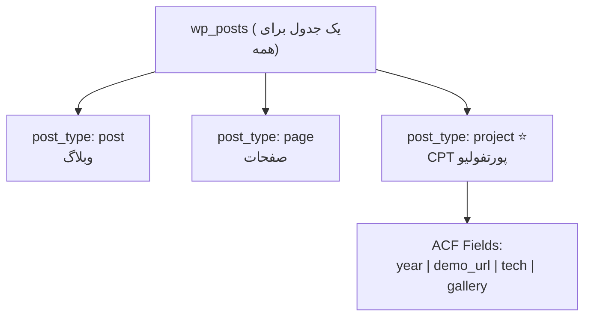

# فصل ۱۰ — Custom Post Types و Custom Fields: محتوای ساخت‌یافته ⭐

> 🎯 **مهم‌ترین فصل بخش اول!** پست و صفحه برای «وبلاگ» کافیه، ولی پروژه واقعی «موجودیت» داره: محصول، پروژه پورتفولیو، نمای ملک، دوره آموزشی... یاد می‌گیری **CPT** بسازی و با **ACF** فیلدهای ساخت‌یافته بهش بدی — این دقیقاً همون مدل داده‌ای است که در Next.js به صورت typed مصرف می‌کنی.

---

## ۱۰.۱ — مسئله: پست برای «محصول» مناسب نیست

سناریو: سایت پورتفولیو می‌سازی؛ مشتری می‌خواد *پروژه* اضافه کنه با: عنوان، توضیح، عکس، سال انجام، لینک دمو، تکنولوژی‌ها. با پست معمولی؟ همه‌چیز می‌ریزه توی یک textarea آزاد — بدون ساختار، بدون کنترل.

**جواب وردپرس:** هر نوع محتوا = یک **Custom Post Type (CPT)** — مثل اینکه `post_type` جدید تعریف کنی. (یادت هست فصل ۴: همه‌چیز در جدول `wp_posts` با ستون `post_type` است؟ حالا داریم به همین ستون، نوع خودمون رو اضافه می‌کنیم!)



## ۱۰.۲ — ساخت CPT: دو راه

### راه ۱: کد (روش حرفه‌ای ⭐)

در `functions.php` تم فرزند (فصل ۵!) یا در یک پلاگین اختصاصی (فصل ۱۱):

```php
add_action('init', function () {
  register_post_type('project', [
    'labels' => [
      'name'          => 'پروژه‌ها',
      'singular_name' => 'پروژه',
    ],
    'public'       => true,          // در سایت و API نمایش داده شود
    'has_archive'  => true,          // صفحه آرشیو داشته باشد
    'menu_icon'    => 'dashicons-portfolio',
    'supports'     => ['title', 'editor', 'thumbnail', 'excerpt'],
    'show_in_rest' => true,          // ⭐⭐ در REST API ظاهر شود — بدون این، API نمی‌دهدش!
    'rewrite'      => ['slug' => 'projects'],
  ]);
});
```

بعد از ذخیره: در پنل، منوی جدید **«پروژه‌ها»** ظاهر شد! ⭐ (اگر نیامد: Settings → Permalinks → Save یک بار بزن — قانون رایج رفرش قواعد URL.)

### راه ۲: پلاگین UI (سریع‌تر برای شروع)

پلاگین **Custom Post Type UI** (CPT UI) → Add New CPT → همین فیلدها را با فرم پر کن. خروجی‌اش همان کد بالا است.

> 💡 نکته دولوپری: برای پروژه Headless، CPT را **با کد** بساز (در پلاگین خودت) تا version-able باشد — مثل تفاوت تنظیم دستی و Infrastructure as Code.

## ۱۰.۳ — Custom Fields با ACF: ساختار دقیق

CPT ساختار *نوع محتوا* را می‌دهد؛ فیلدهای دقیق (سال، لینک، تکنولوژی‌ها) را **Custom Fields** می‌دهند. پادشاه این حوزه پلاگین **ACF** (Advanced Custom Fields) است:

1. نصب ACF (Plugins → Add New → Advanced Custom Fields → Activate)
2. **ACF → Field Groups → Add New:** اسم: «اطلاعات پروژه»
3. **Location rule:** «Post Type is equal to project» — یعنی این فیلدها فقط روی CPT پروژه ظاهر شوند
4. فیلدها را اضافه کن:

| Field Label | Field Name (نام) | نوع | نکته |
|---|---|---|---|
| سال انجام | `year` | Number | |
| لینک دمو | `demo_url` | URL | |
| تکنولوژی‌ها | `technologies` | Checkbox (React، Next، Node...) | چند انتخابی |
| گالری | `gallery` | Gallery | چند عکس |

5. حالا **پروژه‌ها → Add New**: فرم اختصاصی توست! چند پروژه با داده‌های واقعی وارد کن (۳-۴ تا با عکس — سوخت پروژه Next.js!)

> 🔑 `Field Name` (نام انگلیسی) همان کلیدی است که در API می‌گیری — مثل prop های کامپوننت. تمیز و کوتاه بزن (`year` نه «سال انجام پروژه»).

## ۱۰.۴ — خروجی API را همین حالا ببین! (پیش‌تaste فصل ۱۴)

در مرورگر: `wp-course.local/wp-json/wp/v2/projects` — جیسون پروژه‌هایت را می‌بینی! و فیلدهای ACF با پلاگین **ACF to REST API** هم اضافه می‌شوند (`acf: {...}` در خروجی).

همین یک URL یعنی: وردپرس الان یک **بک‌اند استاندارد JSON** برای محتوای توست — و در فصل‌های بعد از داخل Next.js می‌خوانیمش.

## ۱۰.۵ — Taxonomy اختصاصی (اختیاری ولی ارزشمند)

برای پروژه‌ها می‌خوای «دسته‌بندی مهارت» هم داشته باشی؟ Custom Taxonomy:

```php
add_action('init', function () {
  register_taxonomy('tech_stack', 'project', [
    'labels' => ['name' => 'تکنولوژی‌ها', 'singular_name' => 'تکنولوژی'],
    'public' => true,
    'show_in_rest' => true,          // ⭐ باز هم برای API
    'hierarchical' => false,         // مثل تگ، نه دسته درختی
  ]);
});
```

حالا پروژه‌ها را می‌توانی با فیلتر تکنولوژی آرشیو کنی — در Next.js: `/projects?tech=react`.

---

## ✅ جمع‌بندی فصل

- محتوای ساخت‌یافته = **CPT** (نوع محتوا) + **ACF** (فیلدهای دقیق)
- CPT با `register_post_type` یا پلاگین CPT UI؛ حتماً `show_in_rest => true`
- ACF: Field Group + Location rule؛ `Field Name` = کلید API
- پروژه‌های نمونه را همین حالا با داده واقعی بگذار — سوخت فصل ۱۶
- Taxonomy اختصاصی = فیلتر/آرشیو ساخت‌یافته

## 📝 تمرین فصل ۱۰ (پروژه‌محور — تا آخر دوره باهاش کار می‌کنیم!)

1. CPT `project` را با کد (در تم فرزند) بساز — با `show_in_rest` و slug اختصاصی.
2. ACF را نصب کن و Field Group «اطلاعات پروژه» را دقیقاً مثل جدول بالا بساز.
3. سه پروژه واقعی (از رزومه‌ات!) با عکس شاخص و فیلدهای کامل وارد کن.
4. `wp-json/wp/v2/projects` را در مرورگر باز کن — خروجی JSON پروژه‌هایت را ببین (عنوان، slug، آی‌دی).
5. پلاگین **ACF to REST API** را نصب و فعال کن و همان URL را رفرش کن — بخش `acf` را در JSON پیدا کن (`year`, `demo_url`, `technologies`).
6. Taxonomy `tech_stack` را اضافه کن و به پروژه‌ها تکنولوژی بچسبان.

<details><summary>چک‌لیست تمرین ۴-۵</summary>

- `/wp-json/wp/v2/projects` → آرایه‌ای از آبجکت‌ها: `id`, `slug`, `title.rendered`, `_links`
- بعد از ACF to REST API: هر آبجکت یک کلید `acf` دارد → `{"year":"2026","demo_url":"...","technologies":["React","Next"]}`
- اگر 404 گرفتی: Permalink را دوباره Save کن و `show_in_rest` را چک کن — دو پرتکرارترین گیرهای این مرحله!
</details>

➡️ **فصل بعد:** کمی PHP برای دولوپر JS — تا کد وردپرسی‌ها را بخوانی و اولین پلاگینت را بنویسی.
