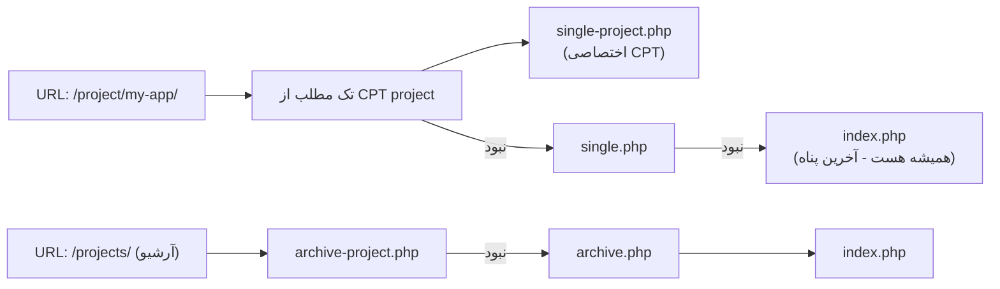

# فصل ۱۱ — PHP برای دولوپر JS: خواندن کد وردپرس و اولین پلاگین

> 🎯 **هدف:** قرار نیست PHP کار بشی — قراره به اندازه‌ای PHP بلد بشی که (۱) کد تم‌ها و پلاگین‌ها رو *بخونی*، (۲) فهم دقیق Hooks داشته باشی، و (۳) اولین پلاگین کاربردی خودت رو بنویسی. با ذهنیت JS/TS که داری، سریع‌تر از فکرت می‌گیری.

---

## ۱۱.۱ — PHP در ۵ دقیقه (با مقایسه به JS)

| مفهوم | JS | PHP |
|---|---|---|
| متغیر | `let x = 1;` | `$x = 1;` ← همیشه با `$` |
| رشته | `'a' + b` | `"a" . $b` ← نقطه = اتصال |
| آرایه | `[1, 2]` | `[1, 2]` |
| آبجکت/دیکشنری | `{a: 1}` | `['a' => 1]` ← `=>` |
| تابع | `function f($a) {}` | `function f($a) {}` (آرگومان با `$`) |
| خروجی | `console.log` | `echo` / `print_r` |
| شرط/حلقه | `if/for/foreach` | یکسان! |
| interpolate | `` `hi ${n}` `` | `"hi $n"` (با دابل‌کوتیشن) |

```php
$projects = ['shop', 'blog'];
foreach ($projects as $p) {
  echo "پروژه: $p <br>";
}

$user = ['name' => 'Ali', 'role' => 'editor'];
echo $user['name'];       // Ali
```

باقی‌اش با context یاد گرفته می‌شه — بذار بریم سراغ جاهایی که واقعاً لازمش داری.

## ۱۱.۲ — Template Hierarchy: وردپرس کدام فایل را نشان می‌دهد؟

وقتی بازدیدکننده یک URL را باز می‌کند، وردپرس با یک درخت تصمیم مشخص می‌کند از کدام فایل تم استفاده کند:



قاعده: **از اختصاصی به عمومی.** `single-{posttype}.php` برای تک‌نمایش هر CPT، `archive-{posttype}.php` برای آرشیوش. (در Block Themes این‌ها template های Site Editor هستند — مفهوم یکی است.)

## ۱۱.۳ — The Loop: قلب نمایش وردپرس

الگوی کلاسیک تم PHP برای پیمایش پست‌ها:

```php
<?php if (have_posts()) : ?>
  <?php while (have_posts()) : the_post(); ?>
    <h2><a href="<?php the_permalink(); ?>"><?php the_title(); ?></a></h2>
    <div><?php the_excerpt(); ?></div>
  <?php endwhile; ?>
<?php else : ?>
  <p>چیزی یافت نشد</p>
<?php endif; ?>
```

به زبان تو:

```ts
if (posts.length) {
  for (const post of posts) {
    console.log(post.title, post.permalink);
  }
} else {
  console.log("چیزی یافت نشد");
}
```

دقیقاً یک map روی داده‌هاست — فقط با توابع کمکی وردپرس (`the_title()` و...). تا اینجای PHP رو که فهمیدی، ۸۰٪ تم‌ها را می‌خوانی.

## ۱۱.۴ — Hooks: سیستم رویداد وردپرس ⭐ (مهم‌ترین مفهوم این فصل)

وردپرس در مسیر اجرایش **هزاران نقطه قلاب** دارد که تو می‌توانی کدت را آویزان کنی — بدون تغییر هسته. دو نوع:

| نوع | کی اجرا می‌شود؟ | می‌تواند چیزی را عوض کند؟ | مثل |
|---|---|---|---|
| **Action** | «وقتی X اتفاق افتاد، این را هم بکن» | نه (فقط کار انجام می‌دهد) | event listener |
| **Filter** | «این مقدار را از من عبور بده» | بله — مقدار را تغییر می‌دهد و برمی‌گرداند | pipe / interceptor |

```php
// Action: بعد از فعال شدن پلاگین، چیزی انجام بده
add_action('init', function () {
  register_post_type('project', [ /* ... فصل ۱۰ ... */ ]);
});

// Filter: عنوان پست‌ها را هنگام نمایش تغییر بده
add_filter('the_title', function ($title, $id) {
  if (get_post_type($id) === 'project') {
    return $title . ' 🚀';
  }
  return $title;   // ⚠️ همیشه مقدار را برگردان!
}, 10, 2);         // اولویت + تعداد آرگومان‌ها
```

با همین دو تابع (`add_action` و `add_filter`) کل وردپرس قابل تغییره — فلسفه open/closed: هسته بسته، توسعه باز.

## ۱۱.۵ — اولین پلاگین واقعی خودت: «تولید پست از قالب»

فصل ۷ دیدی پلاگین = یک PHP با هدر. حالا یکی می‌سازیم که کاری مفید کند: موقع ساخت هر پروژه جدید، به‌طور خودکار مقدار فیلد `year` را سال جاری بگذارد:

در `wp-content/plugins/my-tools/my-tools.php`:

```php
<?php
/**
 * Plugin Name: My Headless Tools
 * Description: ابزارهای پروژه Headless من
 * Version: 1.0.0
 */

// وقتی پروژه جدید ذخیره می‌شود، اگر سال خالی بود، سال جاری را بگذار
add_action('save_post_project', function ($post_id) {
  if (get_post_status($post_id) !== 'publish') return;
  if (!empty(get_field('year', $post_id))) return;      // get_field از ACF
  update_field('year', (int) date('Y'), $post_id);      // update_field از ACF
});
```

پلاگین‌ها → Activate → یک پروژه جدید بدون سال بساز → publish → بازش کن: سال خودش پر شده! 🎉

تو الان یک پلاگین واقعی نوشتی که با event (`save_post_project`) کار می‌کند — دقیقاً همون ذهنیت `onClick`/`onChange` تو.

> ⚠️ سه قانون توسعه پلاگین: (۱) هرگز هسته را ویرایش نکن — همه‌چیز با hook؛ (۲) همه‌چیز را در پلاگین/تم فرزند؛ (۳) قبل از تغییر مهم: Snapshot.

## ۱۱.۶ — ابزارهای دیباگ سریع

```php
// خروجی داده با فرمت خوانا (مثل console.log):
echo '<pre>'; print_r($data); exit;
// یا به لاگ (wp-content/debug.log):
error_log(print_r($data, true));
// فعال‌سازی دیباگ در wp-config.php:
// define('WP_DEBUG', true); define('WP_DEBUG_LOG', true);
```

(`exit` مثل return زودهنگام اسکریپت را می‌کشد — برای دیدن یک متغیر وسط جریان.)

---

## ✅ جمع‌بندی فصل

- PHP = JS با `$` و `.` به جای `+`؛ آرایه انجمنی با `=>`
- Template Hierarchy: از اختصاصی (`single-project.php`) به عمومی (`index.php`)
- The Loop = `posts.map(...)` با توابع کمکی
- **Action = رویداد، Filter = تغییر مقدار** — دو قلاب `add_action` / `add_filter`
- اولین پلاگین واقعی: hook روی `save_post_project` — بدون دست زدن به هسته

## 📝 تمرین فصل ۱۱

1. فایل `single.php` تم Twenty Twenty-Five را باز کن (یا پوشه تم را بگرد) و The Loop را در آن پیدا کن — به زبان JS اش بازنویسیش کن (روی کاغذ).
2. پلاگین «My Headless Tools» را بساز، فعال کن و سناریوی سال خودکار را تست کن.
3. یک `add_filter` روی `the_content` بنویس که آخر همه پست‌های `project` جمله «ساخته شده با ❤️» را اضافه کند — در سایت (نه API) تست کن.
4. (چالش) یک Action روی `wp_insert_post` بنویس که `error_log` کند عنوان هر پست جدید — و فایل `debug.log` را ببین (WP_DEBUG_LOG فعال کن).

<details><summary>جواب تمرین ۳</summary>

```php
add_filter('the_content', function ($content) {
  if (get_post_type() === 'project' && is_singular('project')) {
    return $content . '<p>ساخته شده با ❤️</p>';
  }
  return $content;
});
```
توجه: `the_content` روی فرانت اعمال می‌شود؛ خروجی REST API پیش‌فرض فیلترهای خودش را دارد (در فصل ۱۴ می‌بینی).
</details>

➡️ **فصل بعد:** 🛒 ووکامرس — فروشگاه کامل روی همین دانش: محصولات، سبد خرید و پرداخت ایرانی.
