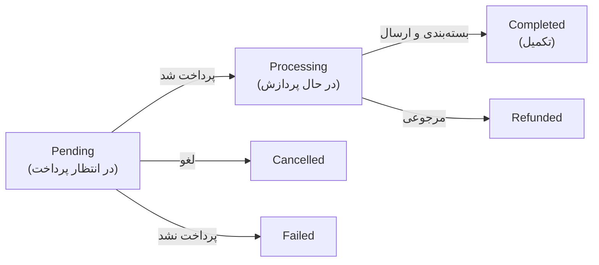

# فصل ۱۲ — 🛒 ووکامرس: فروشگاه کامل

> 🎯 **هدف:** ووکامرس (WooCommerce) = پلاگین فروشگاه‌ساز رایگان دنیا که وردپرس را به یک فروشگاه آنلاین کامل تبدیل می‌کند: محصولات، سبد خرید، تسویه، ارسال و پرداخت. بزرگ‌ترین بازار کار وردپرس ایران است — و نسخه Headless آن (WooGraphQL) هم پشتیبانی می‌شود. آخر فصل یک فروشگاه واقعی با درگاه تست داری.

---

## ۱۲.۱ — ووکامرس: فروشگاه‌ساز استاندارد دنیا

ووکامرس سابقه دارد: متن‌باز، ساخت Automattic (سازنده خود وردپرس)، موتور **~۲۵٪ از کل فروشگاه‌های اینترنتی دنیا**. برای تو یعنی:

- پلاگین است — همان‌طور که فصل ۷ یاد گرفتی: `wp plugin install woocommerce --activate` ⭐
- خودش از CPT داخلی استفاده می‌کند: `product` (محصول)، `order` (سفارش)، `coupon` (کوپن) — یعنی همه دانش CPT/ACF فصل ۱۰ صادق است
- پس از فعال‌سازی: **Wizard راه‌اندازی** می‌آید — آدرس، صنف، فروش فیزیکی/دیجیتال — پیش‌فرض‌ها را رد کن، بعداً همه‌اش قابل تغییر است

بعد از نصب، منوهای جدید پنل: **WooCommerce (پیشخوان فروشگاه)، محصولات، تحلیل‌ها، بازاریابی** و بخش سفارش‌ها.

## ۱۲.۲ — تنظیمات پایه برای بازار ایران

**WooCommerce → Settings** — اول این‌ها را ست کن:

| تب | تنظیم | مقدار برای ایران |
|---|---|---|
| General | واحد پول | **تومان (IRT)** — اگر نبود، با پلاگین فارسی‌ساز می‌آید |
| General | فروش در کشورهای خاص | ایران |
| Products | واحد وزن/بعد | کیلوگرم / سانتی‌متر |
| Tax | فعال‌سازی مالیات | بسته به کسب‌وکار (بیشتر مواقع خاموش تا مشورت حسابدار) |

> 💡 **پلاگین فارسی‌سازی (مهم برای ایران):** پلاگین‌های ایرانی مثل **WP-Parsi** یا ** Jalali** سه کار کلیدی می‌کنند: (۱) تاریخ‌های شمسی در کل فروشگاه، (۲) واحد تومان، (۳) اتصال شهرهای ایران برای ارسال. بدون آن، تاریخ میلادی و قیمت‌های دلاری می‌بینی — در بازار ایران حکم خطای فاحش دارد ⚠️

## ۱۲.۳ — محصولات: چهار نوع

**محصولات → Add New** — اولین تصمیم: نوع محصول:

| نوع | چیست | مثال |
|---|---|---|
| **Simple** (ساده) | یک قیمت، یک موجودی | کابل دو‌وِی ۵ متری |
| **Variable** (متغیر) ⭐ | چند گزینه با قیمت/موجودی متفاوت — با **ویژگی** | کابل با طول: ۵/۱۰/۲۰ متر |
| Virtual | ارسال ندارد | مشاوره آنلاین |
| **Downloadable** (دانلودی) | فایل قابل دانلود بعد از خرید | فایل آموزش PDF |

**داده‌های هر محصول:**

- عنوان + توضیح (ادیتور بلوکی خودمان!) + **توضیح کوتاه** (زیر عنوان محصول در صفحه فروش)
- قیمت عادی / **قیمت تخفیفی (Sale)** ⭐
- **تصویر محصول** (شاخص) + **گالری تصاویر** (چند عکس)
- دسته‌بندی محصول + برچسب محصول (همان taxonomy — جدا از دسته‌های بلاگ!)
- موجودی (SKU کد کالا، تعداد، اجازه سفارش پس‌اتمام؟)
- **ویژگی‌ها (Attributes):** رنگ، سایز، طول... — بعد از تعریف، در تب **Variations** برای هر ترکیب قیمت/موجودی جدا بده (متغیر)

> 🔑 ذهنیت دولوپری: هر محصول = یک post در `wp_posts` با `post_type=product`؛ قیمت و SKU در جدول `wp_postmeta`؛ ویژگی‌ها taxonomy اختصاصی (`pa_color`...) — دقیقاً همان معماری فصل ۱۰ که خودت برای «پروژه» ساختی، فقط حرفه‌ای‌تر.

## ۱۲.۴ — نمایش محصولات در سایت

صفحه فروشگاه و دسته‌ها را ووکامرس خودش می‌سازد (فایل‌های template خودش دارد). برای چیدن محصولات در صفحه دلخواه (مثلاً «پرفروش‌ها» در صفحه خانه):

- **بلوک‌های گوتنبرگ:** بلوک «Best Selling Products» / «On Sale Products» / «Products by Category» — با Site Editor جلوه‌های آماده ⭐
- **شورت‌کد کلاسیک:** `[products limit="4" columns="4" orderby="popularity"]` — در هر صفحه/ویجت کار می‌کند
- در Elementor: ویجت‌های ووکامرس (اگر نصب باشد)

با کد هم برون‌سپاری می‌شود: `wc_get_products([...])` — ولی معمولاً بلوک‌ها کافی‌اند.

## ۱۲.۵ — ویرایش گروهی و کلاس مالیاتی

- **Bulk Edit:** در لیست محصولات، چند محصول تیک بزن → Actions → Edit — قیمت/موجودی/وضعیت را گروهی عوض کن (مثلاً «همه ۱۰٪ تخفیف» — صرفه‌جویی چند ساعته!) ⭐
- **Import/Export:** محصولات را CSV وارد/خارج کن (WooCommerce → Products → All Products → Import) — برای ۵۰۰ محصول اولیه از اکسل مشتری
- **کلاس مالیاتی:** در Settings → Tax — برای فروشگاه‌هایی که نرخ مالیات متفاوت دارند (فعلاً آگاهی کافی است)

## ۱۲.۶ — سبد خرید و گردش سفارش

گردش استاندارد سفارش (وضعیت‌های ووکامرس):



- مشتری: صفحه محصول → **Add to Cart** → سبد → **Checkout** (تسویه: آدرس + روش ارسال + پرداخت) → سفارش ساخته می‌شود
- مدیر: **WooCommerce → Orders** — سفارش‌ها را می‌بینی، وضعیت را تغییر می‌دهی؛ به مشتری ایمیل/پیامک می‌رود (پیامک: فصل ۱۸ ⭐)
- صفحات پیش‌فرض (سبد/تسویه/حساب کاربری) را Wizard خودش می‌سازد — در Settings → Advanced قابل جابجایی‌اند
- **حساب کاربری:** مشتری‌ها در `My Account` سفارش‌ها و آدرس‌هایشان را می‌بینند (نقش کاربری جدید: Customer — فصل ۹)

## ۱۲.۷ — ارسال

Settings → Shipping → **Shipping Zones**:

1. یک Zone بساز: «تهران» → روش: **Flat Rate** (نرخ ثابت، مثلاً ۵۰,۰۰۰ تومان) یا **Free Shipping** (حداقل خرید X)
2. Zone دوم: «سایر شهرها» → نرخ بالاتر
3. **Local Pickup:** تحویل حضوری رایگان
4. هزینه پویا بر اساس وزن: در Flat Rate، فرمول `cost + (weight × per_kg)` — کلاس‌های ارسال (Shipping Classes) برای دسته‌های سنگین/سبک

> 💡 برای پست/تیپاکس واقعی: پلاگین‌های ایرانی (پست پیشتاز/سنجاب) هزینه را از API سرویس پستی می‌گیرند — فصل ۱۸ در لیست افزونه‌های ایرانی می‌بینی.

## ۱۲.۸ — پرداخت: درگاه‌های ایرانی ⭐

پرداخت در ووکامرس با **Payment Gateways** است. درگاه‌های پیش‌فرض (چک/حواله/پرداخت در محل) رایگان‌اند؛ برای پرداخت آنلاین واقعی در ایران:

| درگاه | ویژگی |
|---|---|
| **زرین‌پال (zarinpal.com)** ⭐ | محبوب‌ترین برای شروع — ثبت‌نام ساده، پلاگین ووکامرسی رسمی، کارمزد کم |
| آیدی‌پی (idpay.ir) | تسویه سریع، API تمیز |
| درگاه مستقیم بانکی (ملت/سامان/پارسیان...) | نیاز به حساب تجاری بانک + قرارداد — برای فروشگاه‌های جدی |
| **تست (Sandbox):** درگاه تست زرین‌پال | بدون پول واقعی، کل گردش را تمرین کن ⭐ |

راه‌اندازی (نمونه زرین‌پال): حساب زرین‌پال → Merchant ID را بگیر → پلاگین «پرداخت زرین‌پال برای ووکامرس» را نصب → WooCommerce → Settings → Payments → ZarinPal → Merchant ID + فعال‌سازی. حالا Checkout یک دکمه پرداخت واقعی دارد که به درگاه بانکی می‌رود و برمی‌گردد و وضعیت سفارش را خودکار به Processing می‌گذارد 🎉

**کوپن تخفیف:** Marketing → Coupons — کد/درصد/سقف/تاریخ انقضا/محدودیت ایمیل — همان‌هایی که در فصل ۱۹ برای کمپین مشتری می‌سازی.

## ۱۲.۹ — فروشگاه Headless: پیش‌نگاه WooGraphQL

ووکامرس در WPGraphQL (فصل ۱۵) هم می‌آید — با پلاگین **WooGraphQL** (WPGraphQL for WooCommerce):

```graphql
query {
  products(first: 8) {
    nodes {
      id slug name ... on SimpleProduct { price regularPrice stockStatus }
      ... on VariableProduct { variations { nodes { name price } } }
      image { sourceUrl altText }
    }
  }
}
```

یعنی: پنل = ووکامرس برای مشتری؛ فرانت = Next.js فروشگاهی با React (چرخ/cart server-side). مسیر پیشرفته فصل ۱۶ به بعد — ولی بدان مسیر رسمی است و در بازار، «فروشگاه Headless» بالاترین قیمت را دارد 💰

---

## ✅ جمع‌بندی فصل

- ووکامرس = پلاگین فروشگاه کامل: محصولات/سبد/تسویه/سفارش — با `wp plugin install woocommerce --activate`
- تنظیم ایران: **تومان + شمسی‌سازی با پلاگین ایرانی** — بدون آن فروشگاه «غیرقابل عرضه» است
- ۴ نوع محصول؛ متغیر = ویژگی + ترکیب‌ها؛ تصویر شاخص + گالری
- گردش سفارش: Pending → Processing → Completed (مدیریت از Orders)
- ارسال با Shipping Zones؛ پرداخت با **درگاه ایرانی (زرین‌پال برای شروع) + تست Sandbox**
- WooGraphQL = مسیر فروشگاه Headless — پنل ووکامرسی، فرانت Next.js

## 📝 تمرین فصل ۱۲ (پروژه: فروشگاه ابزار «برق‌آسا»)

1. ووکامرس را نصب/فعال کن و Wizard را بگذار رد بشود؛ تاریخ را شمسی کن (پلاگین فارسی‌ساز نصب کن) و واحد را تومان.
2. ۵ محصول Simple بساز (عکس + گالری + دسته «ابزار برقی» + موجودی) — داده واقعی بگذار، سوخت فصل ۱۶ است.
3. یک محصول **Variable** بساز: کابل با طول ۵/۱۰/۲۰ متر — قیمت‌های متفاوت و موجودی جدا.
4. یک محصول **Downloadable** بساز (یک PDF تست) — بعد از «خرید» در My Account قابل دانلود است؟
5. دو Shipping Zone بساز: تهران ۵۰ هزار تومان؛ بقیه ۸۰ هزار؛ + خرید بالای ۲ میلیون = ارسال رایگان.
6. درگاه تست زرین‌پال را وصل کن و یک سفارش واقعی بزن: سبد → پرداخت تست → برگشت → وضعیت Processing ⭐
7. Bulk Edit: به همه محصولات پرفروش ۱۰٪ تخفیف (قیمت Sale گروهی) — در صفحه فروشگاه ببین.

<details><summary>نکته تمرین ۶</summary>

اگر درگاه تست راه نیفتاد: اول SSL چک (حتی لوکال؛ در Local گواهی خودش) — درگاه‌ها با http کار نمی‌کنند. بعد Merchant ID را با وضعیت «فعال» چک کن. سفارش‌های تست را از Orders → Trash پاک کن تا گزارش‌ها تمیز بمانند.
</details>

➡️ **فصل بعد:** امنیت، بکاپ و نگهداری — سایت فروشگاهی تازه متولد شده؛ حالا باید *زنده نگهش داری*.
