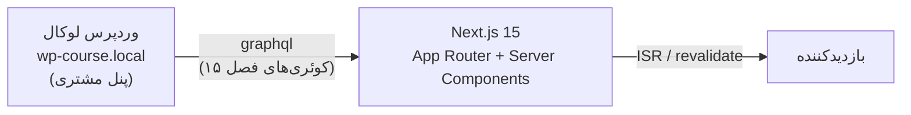

# فصل ۱۶ — 🚀 Next.js + وردپرس: پروژه Headless کامل

> 🎯 **لحظه‌ای که کل دوره برایش ساخته شد:** یک اپ Next.js (App Router) که محتوایش را از وردپرس لوکالت می‌خواند: لیست پست‌ها با عکس، صفحه جزئیات هر پست با slug، و آرشیو پروژه‌های CPT با فیلدهای ACF. فرانت = تو؛ بک‌اند = وردپرس.

---

## ۱۶.۱ — معماری نهایی



و یک نکته امنیتی از دوره‌های قبل: **فقط سرور Next.js به وردپرس وصل می‌شود** (Server Components) — endpoint وردپرس هرگز به مرورگر لو نمی‌رود.

## ۱۶.۲ — ست‌آپ پروژه

```bash
$ npx create-next-app@latest wp-headless --typescript --app --src-dir
$ cd wp-headless
$ npm i graphql-request
```

(`graphql-request` = کلاینت سبک کوئری GraphQL؛ می‌شد با fetch خالی هم رفت — پایین‌تر هر دو را می‌بینی.)

**`.env.local`** (از دوره‌های قبل: هرگز در git!):

```bash
WORDPRESS_API_URL="http://wp-course.local/graphql"
```

> ⚠️ اگر بعداً روی Vercel دپلوی کردی، `wp-course.local` فقط روی سیستم تو معناست — باید وردپرس روی یک هاست عمومی باشد (فصل ۱۷). لوکال را کامل کن، بعد دپلوی.

**لایه داده:** `src/lib/wp.ts` — همه کوئری‌های وردپرس یک‌جا:

```ts
import { GraphQLClient } from "graphql-request";

const client = new GraphQLClient(process.env.WORDPRESS_API_URL!);

type Post = {
  id: string;
  slug: string;
  title: string;
  date: string;
  excerpt?: string;
  content?: string;
  featuredImage?: { node?: { sourceUrl?: string; altText?: string } };
};

export async function getPosts(first = 6): Promise<Post[]> {
  const data = await client.request<{ posts: { nodes: Post[] } }>(`
    query GetPosts($first: Int!) {
      posts(first: $first) {
        nodes {
          id slug title date excerpt
          featuredImage { node { sourceUrl altText } }
        }
      }
    }
  `, { first });
  return data.posts.nodes;
}

export async function getPostBySlug(slug: string): Promise<Post | null> {
  const data = await client.request<{ post: Post | null }>(`
    query GetPost($slug: ID!) {
      post(id: $slug, idType: SLUG) {
        id slug title date content
        featuredImage { node { sourceUrl altText } }
      }
    }
  `, { slug });
  return data.post;
}
```

> 💡 تایپ‌ها دستی نوشتیم؛ ابزار **GraphQL Code Generator** می‌تواند از schema وردپرس تایپ بسازد (یادت که هست — قدم بعدی حرفه‌ای‌ات!).

## ۱۶.۳ — صفحه لیست پست‌ها

`src/app/blog/page.tsx`:

```tsx
import Link from "next/link";
import { getPosts } from "@/lib/wp";

export const revalidate = 60;   // ISR: کش ۶۰ ثانیه (پایین‌تر)

export default async function BlogPage() {
  const posts = await getPosts(12);

  return (
    <main dir="rtl" className="max-w-5xl mx-auto p-6">
      <h1 className="text-3xl font-bold my-8">بلاگ</h1>
      <div className="grid grid-cols-1 sm:grid-cols-3 gap-6">
        {posts.map((post) => (
          <article key={post.id} className="border rounded-xl overflow-hidden hover:shadow-md">
            {post.featuredImage?.node?.sourceUrl && (
              
            )}
            <div className="p-4">
              <h2 className="font-semibold">{post.title}</h2>
              <time className="text-sm text-gray-500">
                {new Date(post.date).toLocaleDateString("fa-IR")}
              </time>
              <Link href={`/blog/${post.slug}`}
                    className="text-blue-600 text-sm mt-2 inline-block">
                ادامه مطلب →
              </Link>
            </div>
          </article>
        ))}
      </div>
    </main>
  );
}
```

Server Component معمولی — `await` مستقیم، بدون useEffect. حمله کن به `http://localhost:3000/blog`!

## ۱۶.۴ — صفحه جزئیات با slug (دینامیک روت)

`src/app/blog/[slug]/page.tsx`:

```tsx
import { notFound } from "next/navigation";
import { getPostBySlug, getPosts } from "@/lib/wp";

export const revalidate = 60;

// پیش‌ساخت صفحات محبوب در build (Static Generation):
export async function generateStaticParams() {
  const posts = await getPosts(10);
  return posts.map((p) => ({ slug: p.slug }));
}

export default async function PostPage({
  params,
}: {
  params: Promise<{ slug: string }>;
}) {
  const { slug } = await params;
  const post = await getPostBySlug(slug);

  if (!post) notFound();

  return (
    <main dir="rtl" className="max-w-2xl mx-auto p-6">
      <h1 className="text-3xl font-bold my-6">{post.title}</h1>
      {post.featuredImage?.node?.sourceUrl && (
        
      )}
      {/* content از وردپرس HTML آماده است: */}
      <article
        className="prose prose-lg mt-6 max-w-none"
        dangerouslySetInnerHTML={{ __html: post.content ?? "" }}
      />
    </main>
  );
}
```

سه نکته‌ی این فایل که «همه‌چیز» است:

1. **`generateStaticParams`** = در build، برای پست‌های شناخته‌شده صفحه HTML آماده می‌سازد (SSG) — سرعت نور
2. **`revalidate = 60`** = ISR: بعد از ۶۰ ثانیه، بعدی که آمد، صفحه از نو از وردپرس رندر می‌شود — یعنی مشتری پست جدید می‌گذارد و حداکثر تا یک دقیقه در سایتت ظاهر می‌شود، بدون دپلوی مجدد!
3. **`dangerouslySetInnerHTML`** = محتوای HTML گوتنبرگ. امن است چون محتوا از پنل خودت می‌آید (نه کاربران ناشناس) — و اسمش فقط ترسناکه!

## ۱۶.۵ — آرشیو پروژه‌ها (CPT + ACF)

`src/app/projects/page.tsx` — با فیلدهای ACF فصل ۱۵:

```tsx
type Project = {
  id: string; slug: string; title: string;
  featuredImage?: { node?: { sourceUrl?: string } };
  projectFields?: {
    year?: number;
    demoUrl?: string;
    technologies?: string[];
  };
};

async function getProjects(): Promise<Project[]> {
  const res = await fetch(process.env.WORDPRESS_API_URL!, {
    method: "POST",                       // GraphQL با POST
    headers: { "Content-Type": "application/json" },
    body: JSON.stringify({
      query: `query { projects(first: 20) {
        nodes { id slug title
          featuredImage { node { sourceUrl } }
          projectFields { year demoUrl technologies }
        } } }`,
    }),
    next: { revalidate: 60 },
  });
  const { data } = await res.json();
  return data.projects.nodes;
}

export default async function ProjectsPage() {
  const projects = await getProjects();
  return (
    <main dir="rtl" className="max-w-5xl mx-auto p-6">
      <h1 className="text-3xl font-bold my-8">پورتفولیو</h1>
      <div className="grid sm:grid-cols-2 gap-6">
        {projects.map((p) => (
          <div key={p.id} className="border rounded-xl p-5">
            <h2 className="font-bold">{p.title}</h2>
            <p className="text-gray-500 text-sm">
              {p.projectFields?.year} — {p.projectFields?.technologies?.join("، ")}
            </p>
            {p.projectFields?.demoUrl && (
              <a href={p.projectFields.demoUrl} target="_blank"
                 className="text-blue-600 text-sm">دمو ↗</a>
            )}
          </div>
        ))}
      </div>
    </main>
  );
}
```

(اینجا عمداً با `fetch` خالی نوشتم تا هر دو روش را دیده باشی — graphql-request یا fetch خام، سلیقه‌ای است.)

## ۱۶.۶ — خلاصه چرخه کامل

```bash
# وردپرس (فصل‌های ۳ تا ۱۵):
docker compose up -d    # ببخشید! mean: در Local دکمه Start 😄

# فرانت:
npm run dev
# /blog        ← لیست از GraphQL
# /blog/[slug] ← جزئیات
# /projects    ← CPT + ACF
```

مشتری در پنل وردپرس پست می‌گذارد → تا ۶۰ ثانیه بعد، سایت Next.js تو به‌روز است. **Headless کامل شد.** 🎉

---

## ✅ جمع‌بندی فصل

- `WORDPRESS_API_URL` در `.env.local`؛ لایه داده در `lib/wp.ts` (کوئری‌های فصل ۱۵)
- لیست = Server Component + grid؛ جزئیات = `[slug]` + `generateStaticParams` + `notFound`
- **`revalidate` = پل زنده بودن محتوا بدون دپلوی** (ISR)
- `content.rendered` با `dangerouslySetInnerHTML` (از پنل خودت = امن)
- CPT/ACF = typed data در کامپوننت‌ها

## 📝 تمرین فصل ۱۶ (پروژه اصلی دوره — حتماً کاملش کن!)

1. پروژه `wp-headless` را بساز، `.env.local` را ست کن و صفحه `/blog` را اجرا کن — پست‌های واقعی‌ات را ببین!
2. صفحه جزئیات `/blog/[slug]` را بساز و از لیست بهش بری.
3. تست ISR: در وردپرس یک پست جدید Publish کن؛ ۶۰ ثانیه صبر، رفرش — هست؟ بعد `revalidate = 10` کن و دوباره تست کن.
4. صفحه `/projects` را با ACF بساز — فیلدهای سال و تکنولوژی را نمایش بده.
5. چالش UI: کارت‌ها را با Tailwind حرفه‌ای کن (سایه، hover، تاریخ فارسی با `toLocaleDateString("fa-IR")`).
6. چالش بعدی: صفحه 404 سفارشی (`not-found.tsx`) و لینک «بازگشت به بلاگ».

<details><summary>نکته تمرین ۳</summary>

ISR با `revalidate` کش سرور Next.js را منقضی می‌کند. برای «آنی» شدن (بدون انتظار ۶۰ ثانیه) راه پیشرفته: Webhook از وردپرس به `revalidatePath` در Next.js (Route Handler) — در فصل ۱۷!
</details>

➡️ **فصل بعد:** حرفه‌ای‌سازی — Preview پیش‌نویس‌ها، فرم‌ها، سئوی Yoast، تصاویر next/image و دپلوی روی Vercel.
