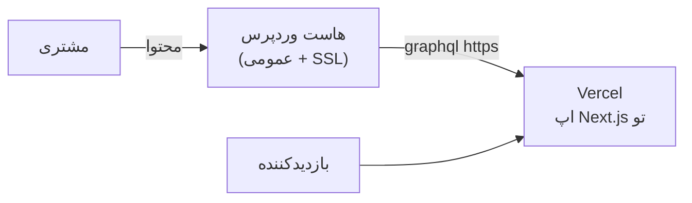

# فصل ۱۷ — Headless پیشرفته: Preview، فرم‌ها، SEO، تصاویر و دپلوی

> 🎯 **هدف:** فصل «تبدیل دمو به محصول» — چهار قابلیتی که پروژه Headless واقعی را از دمو جدا می‌کند: پیش‌نویس‌بینی برای مشتری (Preview)، فرم‌ها، سئوی کامل با داده Yoast، تصاویر بهینه next/image و دپلوی روی Vercel.

---

## ۱۷.۱ — Preview: مشتری پیش‌نویس را ببیند! ⭐

مشکل: پست پیش‌نویس از API عمومی نمی‌آید (فصل ۱۴). مشتری می‌خواهد قبل از Publish ببیند چطور شده. راه‌حل: **Preview Mode** — یک Route Handler که با secret وردپرس، درخواستِ preview را با احراز هویت رندر می‌کند.

**گام ۱ — Route Handler** `src/app/api/preview/route.ts`:

```ts
import { draftMode } from "next/headers";
import { redirect } from "next/navigation";
import { NextRequest } from "next/server";

export async function GET(req: NextRequest) {
  const secret = req.nextUrl.searchParams.get("secret");
  const slug = req.nextUrl.searchParams.get("slug") ?? "";

  // سِکرت را با .env چک کن — هرکس با لینک تصادفی وارد نشود!
  if (secret !== process.env.PREVIEW_SECRET) {
    return new Response("Invalid secret", { status: 401 });
  }

  (await draftMode()).enable();          // فعال‌سازی Draft Mode در Next.js
  redirect(`/blog/${slug}`);
}
```

**گام ۲ — خواندن پیش‌نویس** در `lib/wp.ts`: وقتی draft mode روشن است، کوئری با احراز هویت و `asPreview` بزن:

```ts
export async function getPreviewPost(slug: string, token: string) {
  const client = new GraphQLClient(process.env.WORDPRESS_API_URL!, {
    headers: { Authorization: `Basic ${Buffer.from(
      `${process.env.WP_USER}:${process.env.WP_APP_PASSWORD}`
    ).toString("base64")}` },
  });
  const data = await client.request(`
    query($slug: ID!) {
      post(id: $slug, idType: SLUG, asPreview: true) {
        slug title content date
      }
    }
  `, { slug });
  return data.post;
}
```

(WP_APP_PASSWORD = همان Application Password فصل ۱۴ — Base64 از user:password.)

**گام ۳ — استفاده:** در صفحه `[slug]`، وقتی `draftMode().isEnabled` است، به جای `getPostBySlug`، پیش‌نویس را با توکن بخوان.

**گام ۴ — لینک در وردپرس:** دکمه پیش‌نمایش وردپرس را طوری شخصی‌سازی کن (یا دستی) به:

```
https://your-site.vercel.app/api/preview?secret=XXX&slug=my-draft
```

مشتری روی «Preview» می‌زند → نسخه پیش‌نویس را روی سایت واقعی Next.js می‌بیند — بدون publish! (پلاگین‌هایی مثل Faust.js/Headlessooks همین جریان را خودکار می‌کنند.)

## ۱۷.۲ — فرم‌ها: تماس با ما و کامنت‌ها

**فرم تماس (ساده‌ترین راه درست):** فرم React → Server Action → POST به REST وردپرس (فصل ۱۴ یادته) به یک CPT اختصاصی مثل `پیام‌ها`:

```ts
"use server";
export async function submitContact(formData: FormData) {
  const res = await fetch(`${process.env.WORDPRESS_API_URL!.replace("/graphql", "")}/wp/v2/messages`, {
    method: "POST",
    headers: {
      "Content-Type": "application/json",
      Authorization: `Basic ${Buffer.from(
        `${process.env.WP_USER}:${process.env.WP_APP_PASSWORD}`).toString("base64")}`,
    },
    body: JSON.stringify({
      title: String(formData.get("subject")),
      status: "private",           // پیام‌ها فقط در پنل دیده شوند
      acf: { email: formData.get("email"), message: formData.get("message") },  // با ACF to REST
    }),
  });
  if (!res.ok) return { error: "ارسال نشد" };
  return { ok: true };   // مشتری در پنل وردپرس، باکس «پیام‌ها» را می‌بیند!
}
```

الگوی زیبا: پیام‌ها = یک CPT با ACF؛ مشتری همان‌جا در پنل وردپرس می‌بیندشون. (برای اسپم: honeypot + Google reCAPTCHA سمت کلاینت.)

**کامنت‌ها:** دو راه — (۱) POST به `/wp/v2/comments` (باید `allow_comments` باشد؛ اسپم را Akismet می‌گیرد)، (۲) سرویس آماده مثل Giscus (بر پایه GitHub Discussions — برای بلاگ‌های فنی محبوب).

## ۱۷.۳ — SEO: داده Yoast → metadata نیکست

Yoast (فصل ۷) مقادیر سئو را در وردپرس می‌گذارد؛ با WPGraphQL for SEO (افزونه یوست برای GraphQL) یا REST (`/wp/v2/posts?context=edit` یا پلاگین WPGraphQL Yoast SEO) می‌آیند. الگوی مصرف در Next.js:

```ts
export async function generateMetadata({ params }): Promise<Metadata> {
  const { slug } = await params;
  const post = await getPostBySlug(slug);
  return {
    title: post?.title,
    description: post?.excerpt?.replace(/<[^>]+>/g, "").slice(0, 150),
    openGraph: {
      title: post?.title,
      images: post?.featuredImage?.node?.sourceUrl ? [post.featuredImage.node.sourceUrl] : [],
    },
  };
}
```

و دو فایل استاندارد: `sitemap.ts` (همه slug ها از وردپرس) و `robots.ts` — با توابع آماده Next.js. (اسکلت‌شان را با `sitemap.ts` سرچ کن در داکیومنت؛ داده‌اش همین کوئری لیست پست‌هاست.)

## ۱۷.۴ — تصاویر: next/image با رسانه وردپرس

`` ساده کار می‌کند ولی `next/image` بهینه‌تره (lazy load، سایز درست). برای اینکه Next.js عکس‌های دامنه وردپرسی را قبول کند:

```ts
// next.config.ts
const nextConfig = {
  images: {
    remotePatterns: [
      { protocol: "http", hostname: "wp-course.local" },
      // و دامنه وردپرس production بعداً
    ],
  },
};
```

و در کامپوننت:

```tsx
<Image src={p.featuredImage.node.sourceUrl} alt={p.featuredImage.node.altText ?? ""}
       width={800} height={450} className="rounded-xl" />
```

(اندازه‌های `mediaDetails` فصل ۱۵ را می‌توانی بدهی تا layout shift صفر شود.)

## ۱۷.۵ — دپلوی: Vercel + وردپرس عمومی

معماری production:



گام‌ها:

1. **وردپرس عمومی:** یک هاست وردپرسی (یا VPS با داکر — دوره داکرت!) — سایت وردپرس فقط برای پنل و API است؛ تمش مهم نیست، پیش‌فرض کافی است
2. **تست:** `https://دامنه/wp-json` و `/graphql` از اینترنت در دسترس باشد
3. **Vercel:** ریپو Next.js را import کن → Environment Variables: `WORDPRESS_API_URL` (دامنه واقعی) + رازهای preview
4. تحویل بگیر: هر push به main = دپلوی؛ هر تغییر محتوا در وردپرس = تا `revalidate` ثانیه در سایت

**بعدش (اختیاری حرفه‌ای):** Webhook بلافاصله — پلاگین در وردپرس روی `save_post` یک درخواست به `/api/revalidate?secret=...` بزند و تو در Route Handler با `revalidatePath("/blog")` کش را فوری باطل کنی — همان الگوی `$transaction` دوره Prisma: به‌روزرسانی اتمیِ محتوا. (WPGraphQL Smart Cache هم راه GraphQL-native این کار است.)

## ۱۷.۶ — چک‌لیست تحویل پروژه Headless

- [ ] وردپرس عمومی با SSL؛ پنل با رمز قوی؛ کاربر مشتری = Editor
- [ ] CPT/ACF با `show_in_rest`/GraphQL enabled — versioned در پلاگین خودت
- [ ] Application Password در env های Vercel (هرگز در git)
- [ ] ISR/revalidate تنظیم؛ تست «پست جدید تا یک دقیقه می‌آید»
- [ ] Yoast → metadata/sitemap/robots
- [ ] next/image + remotePatterns
- [ ] فرم تماس + اسپم‌گیر
- [ ] بکاپ خودکار وردپرس (UpdraftPlus — فصل ۷)
- [ ] Preview Mode برای مشتری

---

## ✅ جمع‌بندی فصل

- **Preview** = draft mode + secret + احراز هویت Application Password — مشتری پیش‌نویس را روی سایت واقعی می‌بیند
- فرم‌ها: Server Action → REST POST → CPT پیام‌ها؛ مشتری در پنل می‌بیند
- SEO: Yoast → `generateMetadata` + sitemap/robots
- تصاویر: `remotePatterns` + next/image + alt از رسانه
- دپلوی: وردپرس عمومی + Vercel + ISR؛ ارتقا: Webhook revalidate فوری

## 📝 تمرین فصل ۱۷ (فینال پروژه!)

1. Preview Mode را کامل راه بینداز: secret در هر دو طرف + Route Handler + تست با یک پیش‌نویس.
2. فرم تماس بساز (Client Component با useActionState فصل ۱۵ دوره Next) که پیام را به CPT `messages` بفرستد — در پنل وردپرس ببینش.
3. `generateMetadata` را به صفحه جزئیات اضافه کن — منبع صفحه را ببین (عنوان سئو یوست اگر وصل کردی).
4. همه `` ها را به `next/image` مهاجرت کن + remotePatterns.
5. (اگر هاست داری ⭐) وردپرس را عمومی کن و پروژه را روی Vercel دپلوی کن — لینکش را به رزومه‌ات اضافه کن!
6. چالش فینال: Webhook revalidate — پلاگین WP Webhooks یا کد `save_post` فصل ۱۱ که به Route Handler تویی curl بزند.

<details><summary>اسکلت تمرین ۶</summary>

```ts
// app/api/revalidate/route.ts
import { revalidatePath } from "next/cache";
import { NextRequest } from "next/server";

export async function POST(req: NextRequest) {
  if (req.nextUrl.searchParams.get("secret") !== process.env.PREVIEW_SECRET)
    return new Response("no", { status: 401 });
  revalidatePath("/blog");
  revalidatePath("/projects");
  return Response.json({ revalidated: true });
}
```
و در پلاگین PHP فصل ۱۱: `wp_remote_post("https://site.vercel.app/api/revalidate?secret=...", [...])` روی `save_post`. حالا publish = به‌روزرسانی فوری! 🚀
</details>

➡️ **فصل بعد:** مهاجرت به هاست واقعی و ایران‌سازی — از لوکال به اینترنت؛ با انماد، درگاه و پنل SMS.
