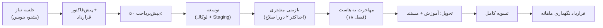

# فصل ۱۹ — فریلنسری و درآمد: مهارت را به قیمت تبدیل کن 💰

> 🎯 **هدف:** تا اینجا ۱۸ فصل مهارت ساختی؛ این فصل ساختن **درآمد** است. سه محصول خدماتی که با همین دوره می‌فروشی، قیمت‌گذاری، پیدا کردن مشتری (ایرانی و جهانی)، گردش کار پروژه از جلسه اول تا تحویل، و قرارداد نگهداری ماهانه. این فصل ورودی‌های نظری ندارد — همه‌اش اجراست.

---

## ۱۹.۱ — بازار: چرا وردپرس هنوز پول‌ساز است؟

- **۴۰٪+ وب دنیا** وردپرسی است و بازار ایران تقریباً تمامِ کسب‌وکارهای کوچک/متوسطش یا وردپرس دارد یا می‌خواهد
- رقابت اصلی تو: سازنده‌های «سایت در ۲۴ ساعت» با تم آماده — ضعف‌شان: بدون سئو، بدون امنیت، بدون نگهداری، بدون مقیاس
- **مزیت تو:** دولوپری که وردپرس را مثل فصل ۱ تا ۲۰ می‌فهمد (CPT/ACF/API) *و* Next.js بلد است — ترکیب کمیاب. در بازار جهانی، «Headless WordPress developer» یک تخصص جست‌وجوشده و پردرآمد است

> 💡 قانون بازار: هرچه تحویل «شخصی‌تر و فنی‌تر»، قیمت بالاتر. تم نصب کنی = قیمت تم؛ فروشگاه واقعی با درگاه/انماد/پیامک بسازی = قیمت پروژه؛ Headless با پرفورمنس تحویل بدهی = قیمت تخصص.

## ۱۹.۲ — سه محصول خدماتی تو

با دانش همین دوره، سه «بسته» با سه سطح قیمت:

| بسته | محتوا | ابزار فصل‌ها | مشتری هدف | قیمت نسبی |
|---|---|---|---|---|
| **۱. سایت شرکتی** | ۵-۸ صفحه، تم بلوکی یا Elementor، فرم، سئوی پایه، SSL، هاست | ۵، ۶، ۸ | کسب‌وکار کوچک | 💰 |
| **۲. فروشگاه ووکامرسی** | بسته ۱ + محصولات، درگاه، انماد، SMS، گزارش | ۱۲، ۱۳، ۱۸ | فروشنده/برند | 💰💰 |
| **۳. سایت Headless premium** | وردپرس به‌عنوان پنل + فرانت Next.js + SEO/ISR + دپلوی | ۱۰-۱۷ | استارتاپ/برند جدی/پروژه بین‌المللی | 💰💰💰 |

قاعده ارائه: هر سه را *داری* — بر اساس بودجه و بلوغ مشتری پیشنهاد بده، نه یک جور سرویس برای همه.

## ۱۹.۳ — قیمت‌گذاری

سه مدل رایج:

1. **پروژه‌ای (Fixed):** رایج‌ترین در ایران. فرمول اولیه: `قیمت = برآورد ساعت × نرخ ساعتی × ۱.۳` (ضریب برای جلسات/اصلاحات/غیرقابل پیش‌بینی)
2. **ساعتی:** برای کار مبهم/مشاوره/تعمیر سایت‌های دیگران (Hacked site repair گران‌تر از ساخت از صفر! چون ریسک داری)
3. **نگهداری ماهانه (Retainer)** ⭐: بسته فصل ۱۳ به‌صورت ماهانه — آپدیت + بکاپ + مانیتورینگ + چند ساعت تغییر. **درآمد تکرارشونده** — ۵ مشتری × X = حقوق ماهانه‌ات بدون پروژه جدید

قواعد چانه‌زنی:

- هرگز قیمت را سر جلسه اول درجا نگو — ۲۴ ساعت «پیش‌فاکتور» بده (مجال محاسبه + اقتدار)
- قیمت پایین‌تر از بازار = مشتری بدتر؛ مراجعان ارزان‌جو وقت تو را می‌خورند
- تخفیف فقط در برابر چیز بده: پرداخت کامل اول کار، یا محتوای آماده توسط مشتری، یا حجم بیشتر

## ۱۹.۴ — مشتری از کجا؟

**ایران:**

- **پونیشا، کارلنسر، ترب:** پروژه‌های وردپرسی روزانه؛ رقابت بالاست — با نمونه‌کار Headless متمایز شو (کسی ندارد!)
- شبکه‌های اجتماعی حرفه‌ای (لینکدین فارسی) + معرفی (پروژه‌های قبلی)
- آژانس‌ها: به عنوان فریلنسر زیرمجموعه کار بگیر — جریان پروژه پایدار، قیمت متوسط
- فروشگاه‌سازهای محلی/غرفه‌داران: نیازمند فروشگاه واقعی (بسته ۲)

**جهانی (Headless تو می‌درخشد ⭐):**

- **Upwork / Fiverr:** جستجو برای `headless wordpress next.js` — رقابت کمتر از وردپرس کلاسیک و نرخ ساعتی ۲-۴ برابری
- لینکدین انگلیسی + GitHub با پروژه‌های open source (پلاگین‌های فصل ۱۱! را به‌عنوان نمونه‌کار فنی منتشر کن)

## ۱۹.۵ — گردش کار پروژه (از تماس تا تحویل)

قواعد طلایی هر مرحله:

- **جلسه نیاز:** دامنه پروژه را *مکتوب* کن — «سایت با ۸ صفحه» نه «یه سایت شیک». محتوا را از مشتری بگیر (عکس‌ها/متن) — تعویق محتوا = تعویق تحویل؛ این را در قرارداد بنویس
- **پیش‌فاکتور:** ریزآیتم‌ها + مدت + پرداخت ۵۰/۵۰ + «محتوا توسط کارفرما» ⭐
- **توسعه:** روی لوکال/Staging نه هاست اصلی؛ Snapshot و بکاپ‌های فصل ۱۳ همیشه
- **بازبینی:** ⭐ حداکثر ۲ دور اصلاح در قرارداد — «اصلاح بی‌نهایت» قاتل سود فریلنسر است
- **تحویل:** چک‌لیست فصل ۱۸ (SSL، سئو، بکاپ، درگاه) + آموزش ویدیویی پنل (Editor نه Admin!)

## ۱۹.۶ — قرارداد: حداقل‌های لازم

چیزی که روز دعوا نجاتت می‌دهد (فرمت پیشنهادی خودت را با مشاوره حقوقی نهایی کن):

1. محدوده کار (قسمت خیریه — هر چیز خارج آن = هزینه جدا)
2. زمان‌بندی با فرض «محتوا تا تاریخ X آماده»
3. پرداخت: ۵۰ شروع / ۵۰ تحویل (پروژه بزرگ: ۳۰/۴۰/۳۰)
4. اصلاحات: ۲ دور، هر دور مشخص
5. **مالکیت:** دامنه و هاست به نام **مشتری** از روز اول ⭐ (سایتِ مشتری به نام تو = گروگان‌گیری برعکس — بدنامی)
6. نگهداری: قرارداد جدا؛ تغییرات خارج نگهداری = پروژه جدید
7. تحویل‌دادنی‌ها: فایل‌ها/دسترسی‌ها/آموزش

## ۱۹.۷ — پورتفولیو: ویترین تو

همین دوره سه نمونه‌کار به تو می‌دهد:

1. **سایت شرکتی «برق‌آسا»** (فصل ۶) — دموی بسته ۱
2. **فروشگاه ابزار** (فصل ۱۲ + فصل ۱۸) — دموی بسته ۲ با درگاه تست
3. **سایت Headless** (فصل ۱۶ + دپلوی فصل ۱۷) ⭐ — این را آنلاین دپلوی کن و لینک بده؛ برای بازار جهانی، پشتش یک Case Study بنویس (معماری: WP as CMS + WPGraphQL + Next.js ISR + Lighthouse score)

> 🔑 فرمت هر Case Study: مشکل → راه‌حل → تکنولوژی → نتیجه (سرعت/سئو) → لینک. متنی، کوتاه، به انگلیسی — در لینکدین و GitHub README.

## ۱۹.۸ — رشد پس از فریلنسری

- **آژانس کوچک:** ۲-۳ نفر (تو فنی، یکی محتوا/پشتیبانی) — ظرفیت پروژه ×۳
- **محصول‌سازی:** قالب/پلاگین ایرانی با پشتیبانی ماهانه فروش؛ یا افزونه‌ای که در پروژه‌ها نوشتی (فصل ۱۱) را عمومی کن
- **آموزش:** دوره/محتوای فارسی Headless WordPress — بازار تقریباً خالی است، همین دوره را دوباره‌فروشی کن 😄
- مسیر بین‌المللی: ریموت‌کارهای Headless (لینکدین + ریموکرافت) با نرخ دلاری

---

## ✅ جمع‌بندی فصل

- سه بسته خدماتی: شرکتی / فروشگاه / **Headless premium** — بر اساس بودجه مشتری پیشنهاد بده
- قیمت = ساعت × نرخ × ۱.۳؛ **نگهداری ماهانه = درآمد تکرارشونده** (فصل ۱۳ می‌فروشی)
- مشتری ایران: پلتفرم‌ها + معرفی؛ جهانی: Headless + لینکدین + GitHub
- گردش کار: نیاز مکتوب → پیش‌فاکتور → ۵۰/۵۰ → توسعه Staging → **۲ دور اصلاح** → مهاجرت → آموزش → تسویه → نگهداری
- قرارداد: محدوده/پرداخت/مالکیت به نام مشتری/نگهداری جدا
- پورتفولیو از همین دوره: ۳ دمو + Case Study انگلیسی برای Headless

## 📝 تمرین فصل ۱۹ (خروجی: بسته فروش تو)

1. سه بسته خدماتی خودت را بنویس: برای هر کدام «چه چیزی تحویل می‌شود» در ۵ بند + زمان تحویل + قیمت (برآورد نرخ ساعت بازار را بپرس/چک کن).
2. یک پیش‌فاکتور نمونه برای «فروشگاه ابزار» بساز (ریزآیتم + شرایط پرداخت + بند محتوا و اصلاح) — قالبش را نگه دار، برای هر مشتری کپی می‌کنی.
3. در پونیشا/کارلنسر ۵ آگهی وردپرسی را بخوان: کدام را با دانش فعلی می‌توانی بگیری؟ برای یکی پیشنهاد (پروپوزال) بنویس.
4. در Upwork جستجوی `headless wordpress` — نرخ‌های ساعتی را یادداشت کن (کیفیت کیف پول را تغییر می‌دهد!).
5. Case Study پروژه Headless فصل ۱۶ را به انگلیسی بنویس (مشکل/راه‌حل/نتیجه) و در GitHub README پروژه بگذار.
6. چک‌لیست نگهداری ماهانه فصل ۱۳ را به یک «بسته نگهداری» با ۳ سطح قیمت تبدیل کن.

نکته تمرین ۳

پروپوزال کوتاه و اختصاصی می‌برد: ۳ خط اول = درک مشکل مشتری (نقل از آگهی‌اش)، بعد راه‌حل تو با نمونه‌کار مرتبط (لینک دمو فصل ۱۶)، بعد زمان/قیمت، بعد یک سؤال هوشمندانه. «Dear sir, I am expert in wordpress...» کپی‌پیست‌ها را نزن — همان‌ها را رد می‌کنند.

➡️ **فصل آخر:** چیت‌شیت جامع و گلاساری — مرور سریع کل دوره.
