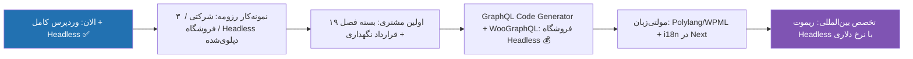

# فصل ۲۰ — چیت‌شیت، گلاساری و نقشه راه

> 🎯 **هدف:** مرجع مرور سریع چهار دنیا: مدیریت وردپرس، صفحه‌سازی و فروشگاه، زیرساخت و مهاجرت، توسعه Headless.

---

## ۲۰.۱ — چیت‌شیت پنل وردپرس

```text
# ─── مسیرهای پنل ───
Posts / Pages            ← محتوای زمان‌دار / ثابت (فصل ۴)
Appearance → Themes      ← نصب و فعال‌سازی تم
Appearance → Editor      ← Site Editor (تم‌های بلوکی) → Header/Footer/Styles
Appearance → Menus       ← منوها + زیرمنو (مگامنو: تنظیمات تم/Elementor — فصل ۶)
Plugins → Add New        ← نصب پلاگین (Install ≠ Activate!)
Users → Profile          ← Application Passwords (پایین صفحه!)
Settings → General       ← زبان (فارسی!)، Timezone، Site Icon (فصل ۶)
Settings → Permalinks    ← ⭐ Post name + Save بعد از ساخت CPT
Settings → Reading       ← صفحه اصلی / تعداد پست / ⚠️ تیک «Discourage» فقط برای تست
WooCommerce → Settings   ← تومان/ارسال/درگاه (فصل ۱۲)
WooCommerce → Orders     ← گردش سفارش: Pending → Processing → Completed
Marketing → Coupons      ← کوپن تخفیف
Yoast/Rank Math          ← SEO Title + متا در هر پست + sitemap (فصل ۸)
UpdraftPlus / Wordfence  ← بکاپ زمان‌بندی‌شده / فایروال و اسکن (فصل ۱۳)

# ─── WP-CLI (در Local → Open Site Shell) ───
wp core version
wp plugin list / install x --activate / update --all / delete x
wp theme list / activate x
wp scaffold child-theme x-child --parent=x
wp post list --post-type=project --fields=ID,post_title
wp db export backup.sql / wp db import backup.sql    # بکاپ و ریستور دستی
wp search-replace "http://old" "https://new"         # مهاجرت دامنه! (فصل ۱۸)
wp maintenance-mode activate / deactivate            # حالت تعمیر (فصل ۱۳)
wp user create boss boss@x.ir --role=editor          # کاربر مشتری

# ─── نجات ───
Local Snapshot            ← کامیت محیط (قبل از هر تغییر بزرگ)
Revision                  ← بازگشت محتوا: ویرایشگر → نسخه‌ها (فصل ۴)
Recovery mode             ← اگر پلاگینی سایت را شکست، ایمیل لینک ریکاوری می‌آید
wp plugin deactivate --all ← سفیدی سایت: همه پلاگین‌ها را خاموش، یکی‌یکی روشن کن
rename plugins folder     ← آخرین راه: FTP/Explorer، پوشه پلاگین مقصر را تغییر نام بده
```

## ۲۰.۲ — چیت‌شیت زیرساخت، مهاجرت و فروشگاه

```text
# ─── مهاجرت لوکال → هاست (فصل ۱۸) ───
۱. بکاپ کامل (فصل ۱۳)                    ← بدون این هیچ قدمی!
۲. دامنه: NS هاست را در پنل دامنه (ایرنیک) وارد کن
۳. نصب روی هاست: Softaculous یک‌کلیکی / دستی: zip + دیتابیس + wp-config
۴. انتقال: All-in-One WP Migration (Export → Import) یا دستی:
   wp-content zip + wp db export + search-replace دامنه
۵. بعد از مهاجرت: SSL (AutoSSL) → تیک سئو برداشته شود
   → Permalinks → Save → تست کامل → GSC → بکاپ دوباره

# ─── سی‌پنل (فصل ۲ و ۱۸) ───
File Manager              ← فایل‌سیستم هاست؛ zip/Extract وردپرس
MySQL Databases           ← ساخت DB + کاربر + اتصال (DB_HOST = localhost)
phpMyAdmin                ← Export/Import دیتابیس؛ جدول wp_posts و wp_postmeta
SSL/TLS Status            ← Run AutoSSL (رایگان Let's Encrypt)
Softaculous               ← نصب وردپرس یک‌کلیکی

# ─── ایران‌سازی (فصل ۱۲ و ۱۸) ───
تومان + شمسی‌سازی         ← پلاگین فارسی‌ساز (WP-Parsi و...) — اولین کار بعد نصب
درگاه پرداخت              ← زرین‌پال/آیدی‌پی (واسطه)؛ مستقیم بانکی = انماد لازم
انماد (enamad.ir)         ← درگاه مستقیم + اعتماد؛ اسکریپت نماد در فوتر
پنل SMS (کاوه‌نگار/ملی)   ← سفارش جدید/تغییر وضعیت → پیامک؛ پلاگین ووکامرسی
Google Business + نشان + بلد ← سئوی محلی؛ NAP یکسان همه‌جا (فصل ۸)
```

## ۲۰.۳ — چیت‌شیت Headless (کوئری‌ها و کد)

```graphql
# ─── GraphQL (فصل ۱۵) ───
query GetPosts($first: Int!) {
  posts(first: $first) {
    pageInfo { hasNextPage endCursor }
    nodes {
      id slug title date excerpt
      featuredImage { node { sourceUrl altText } }
      categories { nodes { name slug } }
    }
  }
}

query GetPost($slug: ID!) {
  post(id: $slug, idType: SLUG) {
    title content date
    author { node { name } }
    featuredImage { node { sourceUrl } }
  }
}

query GetProjects {
  projects(first: 20) {
    nodes {
      slug title
      featuredImage { node { sourceUrl } }
      projectFields { year demoUrl technologies }   # ACF
      techStack { nodes { name } }                  # taxonomy
    }
  }
}
```

```ts
// ─── الگوهای Next.js (فصل ۱۶-۱۷) ───
export const revalidate = 60;                 // ISR — محتوا تا ۶۰ ثانیه تازه
export async function generateStaticParams() { ... }   // SSG برای slug ها
const { slug } = await params;                // params یک Promise است!
if (!post) notFound();                        // 404 تمیز
dangerouslySetInnerHTML={{ __html: post.content }}     // HTML گوتنبرگ (از پنل خودت = امن)
(await draftMode()).enable();                 // Preview Mode
revalidatePath("/blog");                      // Webhook وردپرس → به‌روزرسانی فوری
```

```bash
# ─── REST سریع (فصل ۱۴) ───
GET  /wp-json/wp/v2/posts?slug=xxx&per_page=10
GET  /wp-json/wp/v2/projects           # CPT (show_in_rest!)
POST /wp-json/wp/v2/posts  -u "user:app-pass" -d '{"title":"...","status":"draft"}'
هدر X-WP-Total                          # تعداد کل (pagination)
```

## ۲۰.۴ — گلاساری فارسی–انگلیسی

| انگلیسی | فارسی | یک جمله |
|---|---|---|
| CMS | سامانه مدیریت محتوا | پنلی که مشتری با آن محتوا می‌گذارد |
| Domain / TLD | دامنه / پسوند | اسم سایت — `.ir` با ایرنیک، `.com` جهانی (فصل ۲) |
| Hosting | هاست | خانه فایل‌ها؛ اشتراکی/VPS — با PHP+MySQL |
| DNS / Nameserver | دی‌ان‌اس | دفتر تلفن: رکورد A، CNAME، MX، NS (فصل ۲) |
| SSL / HTTPS | گواهی امنیتی | قفل سبز — رایگان با Let's Encrypt |
| cPanel / File Manager | سی‌پنل / فایل منیجر | GUI هاست: فایل‌ها، دیتابیس، SSL، نصب وردپرس |
| Post / Page | نوشته / برگه | محتوای زمان‌دار / ثابت |
| Gutenberg / Block | گوتنبرگ / بلوک | ادیتور و واحد UI (با React!) |
| Theme (Block/Classic) | تم بلوکی/کلاسیک | ظاهر سایت — جدید: Site Editor |
| Child Theme | تم فرزند | لایه تغییرات تو، جدا از تم اصلی |
| Plugin | افزونه | بسته قابلیت (npm وردپرس) |
| Page Builder | صفحه‌ساز | Elementor/WPBakery — Section/Column/Widget (فصل ۶) |
| Mega Menu | مگامنو | زیرمنوی پهن چندستونه برای دسته‌های بزرگ |
| Favicon / Site Icon | آیکون سایت | لوگوی کوچک کنار تب مرورگر |
| SEO / Meta Title | سئو / عنوان متا | دیده‌شدن در گوگل؛ مهم‌ترین تگ صفحه (فصل ۸) |
| Sitemap | نقشه سایت | فهرست XML صفحات برای گوگل (`/sitemap_index.xml`) |
| Search Console | سرچ کنسول | پنل گوگل: ایندکس، sitemap، گزارش‌ها |
| WooCommerce | ووکامرس | فروشگاه‌ساز وردپرس: محصول/سبد/سفارش (فصل ۱۲) |
| Variable Product | محصول متغیر | چند گزینه (رنگ/سایز) با قیمت و موجودی جدا |
| Payment Gateway | درگاه پرداخت | واسطه بانکی (زرین‌پال...) یا مستقیم با انماد |
| Enamad | انماد | نماد اعتماد الکترونیکی — پیش‌نیاز درگاه مستقیم |
| SMS Panel | پنل پیامک | اطلاع‌رسانی سفارش/تأیید با SMS (فصل ۱۸) |
| Role | نقش کاربری | Subscriber→Author→Editor→Admin — مشتری = Editor |
| Slug | نامک | بخش آخر URL — کلید routing تو |
| CPT (Custom Post Type) | نوع محتوای سفارشی | محصول/پروژه/نمونه کار — ساختار داده |
| Custom Field / ACF | فیلد سفارشی | فیلدهای ساخت‌یافته (year، url...) |
| Taxonomy | طبقه‌بندی | دسته/برچسب سفارشی برای فیلتر |
| WP-CLI | — | خط فرمان وردپرس (db/search-replace/maintenance) |
| Hook (Action/Filter) | قلاب | رویداد / تغییر مقدار — هسته توسعه PHP |
| WP REST API | — | `/wp-json/wp/v2/...` — JSON استاندارد |
| Application Password | رمز برنامه | توکن برای API (مثل PAT) |
| WPGraphQL / GraphiQL | — | سرور و پلی‌گراند GraphQL وردپرس |
| Headless | بدون سر (فرانت جدا) | وردپرس فقط بک‌اند؛ فرانت = Next.js |
| ISR / revalidate | بازاعتبارسنجی | کش با انقضا — محتوا تازه بدون دپلوی |
| Draft Mode | حالت پیش‌نویس | دیدن پیش‌نویس در سایت Next.js |
| Maintenance Mode | حالت تعمیر | صفحه «به‌زودی» هنگام تغییرات (فصل ۱۳) |
| Staging | استیجینگ | نسخه تست سایت — آپدیت اول آنجا، بعد Live |
| CDN | شبکه توزیع محتوا | Cloudflare/داخلی — سرعت + لایه امنیتی |
| SMTP | — | ارسال واقعی ایمیل‌های وردپرس (WP Mail SMTP) |
| Retainer | نگهداری ماهانه | درآمد تکرارشونده: آپدیت/بکاپ/مانیتورینگ (فصل ۱۹) |

## ۲۰.۵ — گیرهای کلاسیک و علاج

| مشکل | علاج |
|---|---|
| CPT در پنل نیامد | کد را چک کن؛ بعد Settings → Permalinks → Save (رفرش قواعد) |
| CPT در REST 404 داد | `show_in_rest => true` نذاشدی (فصل ۱۰) |
| فیلدهای ACF در API نیست | پلاگین ACF to REST / Show in GraphQL در Field Group |
| کوئری GraphQL فیلد را نمی‌شناسد | Ctrl+Space در GraphiQL = autocomplete schema؛ refresh |
| عکس در next/image لود نشد | remotePatterns در next.config (فصل ۱۷) |
| محتوا آپدیت نمی‌شود | `revalidate` را چک کن؛ برای فوری: Webhook (فصل ۱۷) |
| Preview خالی/404 | secret دو طرف یکی نیست؛ Application Password فعال؟ |
| سایت سفید شد (کد PHP) | `wp plugin deactivate --all`؛ WP_DEBUG روشن کن؛ Snapshot بازگردان |
| ارور حافظه/سنگینی | پلاگین‌های اضافه را کم کن؛ PHP memory در Local قابل افزایش |
| `params` بدون await ارور داد | در Next 15 params یک Promise است: `await params` |
| بعد از مهاجرت عکس‌ها/لینک‌ها شکستند | سرچ‌ریپلیس دامنه کامل نمانده — Better Search Replace روی همه جدول‌ها (فصل ۱۸) |
| بعد از مهاجرت همه‌چیز 404 است | Settings → Permalinks → Save (ری‌نوشت .htaccess) |
| ایمیل‌های سایت نمی‌رسند | `mail()` هاست خاموش/اسپم — WP Mail SMTP + تست ایمیل (فصل ۱۳) |
| درگاه پرداخت سفارش را آپدیت نمی‌کند | SSL فعال نیست؛ IPN/callback یا Merchant ID چک شود؛ لاگ درگاه |
| ووکامرس تاریخ میلادی/قیمت دلاری | پلاگین فارسی‌ساز نصب/فعال نیست؛ واحد پول در Settings (فصل ۱۲) |
| محصول متغیر گزینه ندارد | ویژگی (Attribute) را Save کن، بعد تب Variations → Generate ⭐ |
| هک شد/ریدایرکت اسپم | Wordfence Scan یا ریستور بکاپ تمیز + تعویض همه رمزها (فصل ۱۳) |

## ۲۰.۶ — نقشه راه پس از این دوره



**سه توصیه پایانی:**

1. **پروژه رزومه بساز و آنلاینش کن:** سایت Headless وردپرس + Next.js با داده واقعی روی Vercel — در بازار ایران این ترکیب کمیاب و پول‌ساز است؛ لینکش را بالای رزومه‌ات بگذار (فصل ۱۹: Case Study انگلیسی).
2. **وردپرس را مثل محصول نگه دار:** آپدیت‌ها، بکاپ ۳-۲-۱، پلاگین کم، رمز قوی، Wordfence — ۹۰٪ ماجرا همین انضباط است (فصل ۱۳) و همان است که مشتری بابتش ماهانه می‌پردازد.
3. **داکیومنت رسمی:** developer.wordpress.org (REST + Block Editor)، www.wpgraphql.com/docs و داکیومنت ووکامرس — هر سه با پایه‌ای که الان داری خوانا شده‌اند.

**سفر پنج‌گانه‌ات تا اینجا:** PostgreSQL+Prisma ✅ → Git/GitHub ✅ → CLI ✅ → Docker ✅ → WordPress کامل + Headless ✅

تو الان می‌توانی: دیتابیس طراحی کنی، با تیم کار کنی، ترمینال را هدایت کنی، روی سرور دپلوی کنی — و حالا سایت شرکتی و فروشگاه ایرانی تحویل بدهی، CMS را برای مشتری مهاجرت و نگهداری کنی، و با Next.js فرانت مدرن بسازی. پکیج کامل فول‌استک + بازار! 🎉🚀
